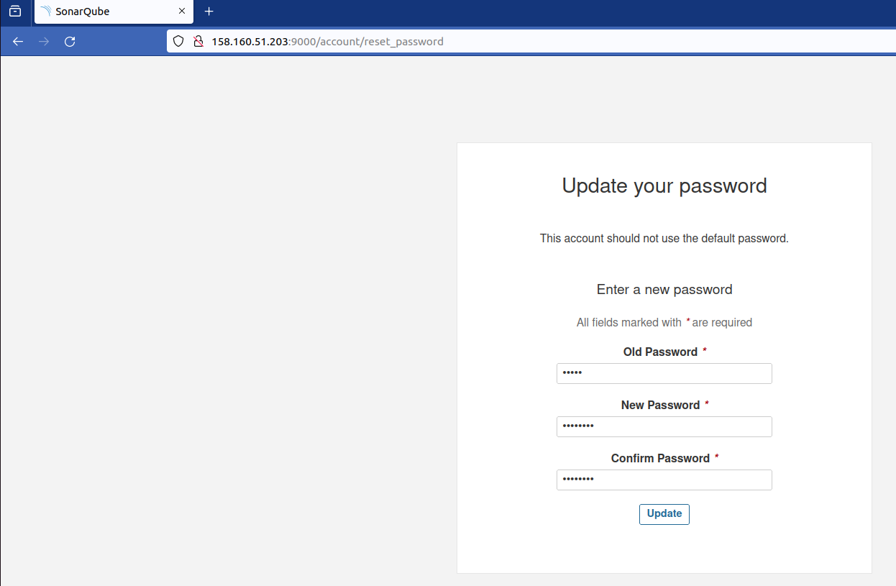
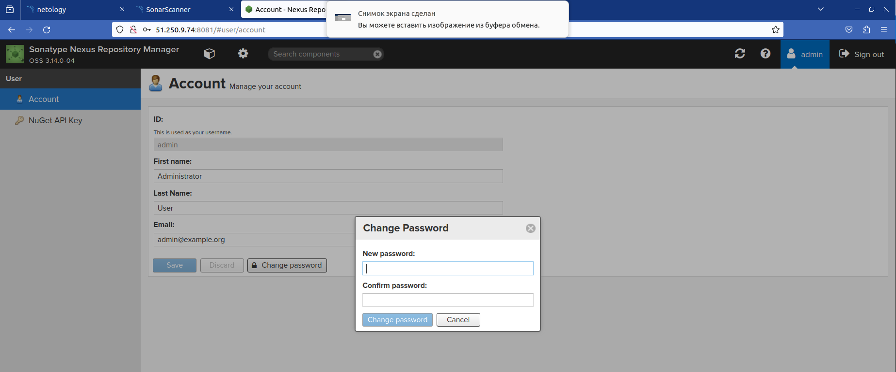
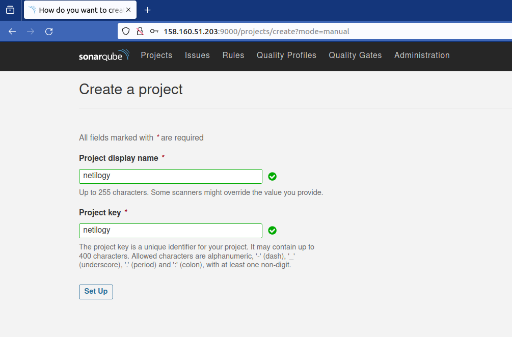
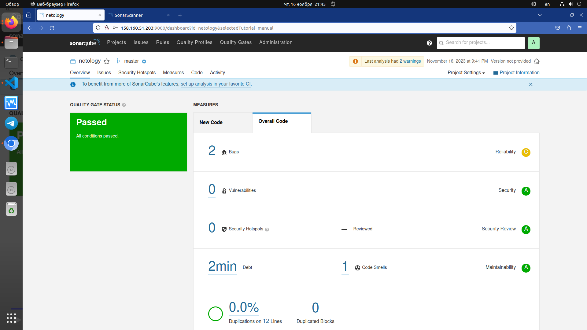
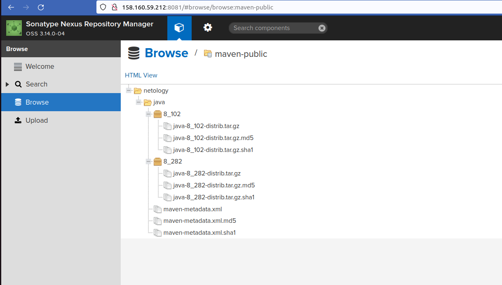

# Домашнее задание к занятию 9 «Процессы CI/CD»

## Подготовка к выполнению

1. Создайте два VM в Yandex Cloud с параметрами: 2CPU 4RAM Centos7 (остальное по минимальным требованиям).
>Создана инфраструктура из трех хостов в Yandex Cloud при помощи [Terraform](terraform) 
```bash
Apply complete! Resources: 4 added, 0 changed, 0 destroyed.

Outputs:

external_ip_address_vm_01 = "158.160.59.212"
external_ip_address_vm_02 = "158.160.53.181"
```
2. Пропишите в [inventory](./infrastructure/inventory/cicd/hosts.yml) [playbook](./infrastructure/site.yml) созданные хосты.
>В файл  [inventory](./infrastructure/inventory/cicd/hosts.yml) прописаны хосты созданныу в Yandex Cloud.

3. Добавьте в [files](./infrastructure/files/) файл со своим публичным ключом (id_rsa.pub). Если ключ называется иначе — найдите таску в плейбуке, которая использует id_rsa.pub имя, и исправьте на своё.
>Добавлен id_rsa.pub в папку [files](./infrastructure/files/).

4. Запустите playbook, ожидайте успешного завершения.
>`ansible-playbook -i inventory/cicd/hosts.yml site.yml `
>Успешное завершение playbook
```bash
PLAY RECAP ***************************************************************************************************************************
nexus-01                   : ok=17   changed=15   unreachable=0    failed=0    skipped=2    rescued=0    ignored=0   
sonar-01                   : ok=35   changed=27   unreachable=0    failed=0    skipped=0    rescued=0    ignored=0   

```
5. Проверьте готовность SonarQube через [браузер](http://localhost:9000).
6. Зайдите под admin\admin, поменяйте пароль на свой.

7.  Проверьте готовность Nexus через [бразуер](http://localhost:8081).
8. Подключитесь под admin\admin123, поменяйте пароль, сохраните анонимный доступ.


## Знакомоство с SonarQube

### Основная часть

1. Создайте новый проект, название произвольное.


2. Скачайте пакет sonar-scanner, который вам предлагает скачать SonarQube.
```bash
tim@tim:~/nl/devops-netology/ansible/09-ci-03-cicd/infrastructure$ ls -lah ~/sonar-scanner-5.0.1.3006-linux/
итого 24K
drwxr-xr-x  6 tim tim 4,0K авг  4 19:32 .
drwx------ 52 tim tim 4,0K ноя 16 20:58 ..
drwxr-xr-x  2 tim tim 4,0K авг  4 19:32 bin
drwxr-xr-x  2 tim tim 4,0K авг  4 19:31 conf
drwxr-xr-x  6 tim tim 4,0K авг  4 19:32 jre
drwxr-xr-x  2 tim tim 4,0K авг  4 19:32 lib
tim@tim:~/nl/devops-netology/ansible/09-ci-03-cicd/infrastructure$ 
```

3. Сделайте так, чтобы binary был доступен через вызов в shell (или поменяйте переменную PATH, или любой другой, удобный вам способ).
```bash
tim@tim:~/nl/devops-netology/ansible/09-ci-03-cicd/infrastructure$ cd ~/sonar-scanner-5.0.1.3006-linux/bin/
tim@tim:~/sonar-scanner-5.0.1.3006-linux/bin$ export PATH=$(pwd):$PATH
```

4. Проверьте `sonar-scanner --version`.
```bash
tim@tim:~/nl/devops-netology/ansible/09-ci-03-cicd/example$ sonar-scanner --version
INFO: Scanner configuration file: /home/tim/sonar-scanner-5.0.1.3006-linux/conf/sonar-scanner.properties
INFO: Project root configuration file: NONE
INFO: SonarScanner 5.0.1.3006
INFO: Java 17.0.7 Eclipse Adoptium (64-bit)
INFO: Linux 6.2.0-36-generic amd64
tim@tim:~/nl/devops-netology/ansible/09-ci-03-cicd/example$ 
```

5. Запустите анализатор против кода из директории [example](./example) с дополнительным ключом `-Dsonar.coverage.exclusions=fail.py`.
```bash
tim@tim:~/nl/devops-netology/ansible/09-ci-03-cicd/example$ sonar-scanner \
  -Dsonar.projectKey=netology \
  -Dsonar.sources=. \
  -Dsonar.host.url=http://158.160.51.203:9000 \
  -Dsonar.login=b302c6fe7cf986b4cdf9a3938d51694b8bf8ff82 \
> -Dsonar.coverage.exclusions=fail.py
INFO: Scanner configuration file: /home/tim/sonar-scanner-5.0.1.3006-linux/conf/sonar-scanner.properties
INFO: Project root configuration file: NONE
INFO: SonarScanner 5.0.1.3006
INFO: Java 17.0.7 Eclipse Adoptium (64-bit)
INFO: Linux 6.2.0-36-generic amd64
INFO: User cache: /home/tim/.sonar/cache
INFO: Analyzing on SonarQube server 9.1.0
INFO: Default locale: "ru_RU", source code encoding: "UTF-8" (analysis is platform dependent)
INFO: Load global settings
INFO: Load global settings (done) | time=99ms
INFO: Server id: 9CFC3560-AYvZH5QgLUrNLscfYdzh
INFO: User cache: /home/tim/.sonar/cache
INFO: Load/download plugins
INFO: Load plugins index
INFO: Load plugins index (done) | time=67ms
INFO: Load/download plugins (done) | time=36423ms
INFO: Process project properties
INFO: Process project properties (done) | time=6ms
INFO: Execute project builders
INFO: Execute project builders (done) | time=1ms
INFO: Project key: netology
INFO: Base dir: /home/tim/nl/devops-netology/ansible/09-ci-03-cicd/example
INFO: Working dir: /home/tim/nl/devops-netology/ansible/09-ci-03-cicd/example/.scannerwork
INFO: Load project settings for component key: 'netology'
INFO: Load project settings for component key: 'netology' (done) | time=53ms
INFO: Load quality profiles
INFO: Load quality profiles (done) | time=178ms
INFO: Load active rules
INFO: Load active rules (done) | time=3434ms
INFO: Indexing files...
INFO: Project configuration:
INFO:   Excluded sources for coverage: fail.py
INFO: 1 file indexed
INFO: 0 files ignored because of scm ignore settings
INFO: Quality profile for py: Sonar way
INFO: ------------- Run sensors on module netology
INFO: Load metrics repository
INFO: Load metrics repository (done) | time=53ms
INFO: Sensor Python Sensor [python]
WARN: Your code is analyzed as compatible with python 2 and 3 by default. This will prevent the detection of issues specific to python 2 or python 3. You can get a more precise analysis by setting a python version in your configuration via the parameter "sonar.python.version"
INFO: Starting global symbols computation
INFO: 1 source file to be analyzed
INFO: Load project repositories
INFO: Load project repositories (done) | time=31ms
INFO: 1/1 source file has been analyzed
INFO: Starting rules execution
INFO: 1 source file to be analyzed
INFO: 1/1 source file has been analyzed
INFO: Sensor Python Sensor [python] (done) | time=771ms
INFO: Sensor Cobertura Sensor for Python coverage [python]
INFO: Sensor Cobertura Sensor for Python coverage [python] (done) | time=9ms
INFO: Sensor PythonXUnitSensor [python]
INFO: Sensor PythonXUnitSensor [python] (done) | time=4ms
INFO: Sensor CSS Rules [cssfamily]
INFO: No CSS, PHP, HTML or VueJS files are found in the project. CSS analysis is skipped.
INFO: Sensor CSS Rules [cssfamily] (done) | time=1ms
INFO: Sensor JaCoCo XML Report Importer [jacoco]
INFO: 'sonar.coverage.jacoco.xmlReportPaths' is not defined. Using default locations: target/site/jacoco/jacoco.xml,target/site/jacoco-it/jacoco.xml,build/reports/jacoco/test/jacocoTestReport.xml
INFO: No report imported, no coverage information will be imported by JaCoCo XML Report Importer
INFO: Sensor JaCoCo XML Report Importer [jacoco] (done) | time=5ms
INFO: Sensor C# Project Type Information [csharp]
INFO: Sensor C# Project Type Information [csharp] (done) | time=0ms
INFO: Sensor C# Analysis Log [csharp]
INFO: Sensor C# Analysis Log [csharp] (done) | time=13ms
INFO: Sensor C# Properties [csharp]
INFO: Sensor C# Properties [csharp] (done) | time=0ms
INFO: Sensor JavaXmlSensor [java]
INFO: Sensor JavaXmlSensor [java] (done) | time=1ms
INFO: Sensor HTML [web]
INFO: Sensor HTML [web] (done) | time=5ms
INFO: Sensor VB.NET Project Type Information [vbnet]
INFO: Sensor VB.NET Project Type Information [vbnet] (done) | time=0ms
INFO: Sensor VB.NET Analysis Log [vbnet]
INFO: Sensor VB.NET Analysis Log [vbnet] (done) | time=14ms
INFO: Sensor VB.NET Properties [vbnet]
INFO: Sensor VB.NET Properties [vbnet] (done) | time=0ms
INFO: ------------- Run sensors on project
INFO: Sensor Zero Coverage Sensor
INFO: Sensor Zero Coverage Sensor (done) | time=0ms
INFO: SCM Publisher SCM provider for this project is: git
INFO: SCM Publisher 1 source file to be analyzed
INFO: SCM Publisher 0/1 source files have been analyzed (done) | time=63ms
WARN: Missing blame information for the following files:
WARN:   * fail.py
WARN: This may lead to missing/broken features in SonarQube
INFO: CPD Executor Calculating CPD for 1 file
INFO: CPD Executor CPD calculation finished (done) | time=8ms
INFO: Analysis report generated in 125ms, dir size=103,2 kB
INFO: Analysis report compressed in 16ms, zip size=14,2 kB
INFO: Analysis report uploaded in 92ms
INFO: ANALYSIS SUCCESSFUL, you can browse http://158.160.51.203:9000/dashboard?id=netology
INFO: Note that you will be able to access the updated dashboard once the server has processed the submitted analysis report
INFO: More about the report processing at http://158.160.51.203:9000/api/ce/task?id=AYvZcEOCLUrNLscfYi41
INFO: Analysis total time: 6.573 s
INFO: ------------------------------------------------------------------------
INFO: EXECUTION SUCCESS
INFO: ------------------------------------------------------------------------
INFO: Total time: 50.094s
INFO: Final Memory: 18M/80M
INFO: ------------------------------------------------------------------------
tim@tim:~/nl/devops-netology/ansible/09-ci-03-cicd/example$ 
```

6. Посмотрите результат в интерфейсе.


7. Исправьте ошибки, которые он выявил, включая warnings.
>[файл с исправленными ошибками](example/fail.py)

8. Запустите анализатор повторно — проверьте, что QG пройдены успешно.
```bash
tim@tim:~/nl/devops-netology/ansible/09-ci-03-cicd/example$ sonar-scanner   -Dsonar.projectKey=netology   -Dsonar.sources=.   -Dsonar.host.url=http://158.160.51.203:9000   -Dsonar.login=b302c6fe7cf986b4cdf9a3938d51694b8bf8ff82 -Dsonar.coverage.exclusions=fail.py
INFO: Scanner configuration file: /home/tim/sonar-scanner-5.0.1.3006-linux/conf/sonar-scanner.properties
INFO: Project root configuration file: NONE
INFO: SonarScanner 5.0.1.3006
INFO: Java 17.0.7 Eclipse Adoptium (64-bit)
INFO: Linux 6.2.0-36-generic amd64
INFO: User cache: /home/tim/.sonar/cache
INFO: Analyzing on SonarQube server 9.1.0
INFO: Default locale: "ru_RU", source code encoding: "UTF-8" (analysis is platform dependent)
INFO: Load global settings
INFO: Load global settings (done) | time=93ms
INFO: Server id: 9CFC3560-AYvZH5QgLUrNLscfYdzh
INFO: User cache: /home/tim/.sonar/cache
INFO: Load/download plugins
INFO: Load plugins index
INFO: Load plugins index (done) | time=56ms
INFO: Load/download plugins (done) | time=164ms
INFO: Process project properties
INFO: Process project properties (done) | time=6ms
INFO: Execute project builders
INFO: Execute project builders (done) | time=2ms
INFO: Project key: netology
INFO: Base dir: /home/tim/nl/devops-netology/ansible/09-ci-03-cicd/example
INFO: Working dir: /home/tim/nl/devops-netology/ansible/09-ci-03-cicd/example/.scannerwork
INFO: Load project settings for component key: 'netology'
INFO: Load project settings for component key: 'netology' (done) | time=28ms
INFO: Load quality profiles
INFO: Load quality profiles (done) | time=133ms
INFO: Load active rules
INFO: Load active rules (done) | time=2327ms
INFO: Indexing files...
INFO: Project configuration:
INFO:   Excluded sources for coverage: fail.py
INFO: 1 file indexed
INFO: 0 files ignored because of scm ignore settings
INFO: Quality profile for py: Sonar way
INFO: ------------- Run sensors on module netology
INFO: Load metrics repository
INFO: Load metrics repository (done) | time=50ms
INFO: Sensor Python Sensor [python]
WARN: Your code is analyzed as compatible with python 2 and 3 by default. This will prevent the detection of issues specific to python 2 or python 3. You can get a more precise analysis by setting a python version in your configuration via the parameter "sonar.python.version"
INFO: Starting global symbols computation
INFO: 1 source file to be analyzed
INFO: Load project repositories
INFO: Load project repositories (done) | time=31ms
INFO: 1/1 source file has been analyzed
INFO: Starting rules execution
INFO: 1 source file to be analyzed
INFO: 1/1 source file has been analyzed
INFO: Sensor Python Sensor [python] (done) | time=637ms
INFO: Sensor Cobertura Sensor for Python coverage [python]
INFO: Sensor Cobertura Sensor for Python coverage [python] (done) | time=8ms
INFO: Sensor PythonXUnitSensor [python]
INFO: Sensor PythonXUnitSensor [python] (done) | time=0ms
INFO: Sensor CSS Rules [cssfamily]
INFO: No CSS, PHP, HTML or VueJS files are found in the project. CSS analysis is skipped.
INFO: Sensor CSS Rules [cssfamily] (done) | time=1ms
INFO: Sensor JaCoCo XML Report Importer [jacoco]
INFO: 'sonar.coverage.jacoco.xmlReportPaths' is not defined. Using default locations: target/site/jacoco/jacoco.xml,target/site/jacoco-it/jacoco.xml,build/reports/jacoco/test/jacocoTestReport.xml
INFO: No report imported, no coverage information will be imported by JaCoCo XML Report Importer
INFO: Sensor JaCoCo XML Report Importer [jacoco] (done) | time=3ms
INFO: Sensor C# Project Type Information [csharp]
INFO: Sensor C# Project Type Information [csharp] (done) | time=0ms
INFO: Sensor C# Analysis Log [csharp]
INFO: Sensor C# Analysis Log [csharp] (done) | time=12ms
INFO: Sensor C# Properties [csharp]
INFO: Sensor C# Properties [csharp] (done) | time=0ms
INFO: Sensor JavaXmlSensor [java]
INFO: Sensor JavaXmlSensor [java] (done) | time=1ms
INFO: Sensor HTML [web]
INFO: Sensor HTML [web] (done) | time=2ms
INFO: Sensor VB.NET Project Type Information [vbnet]
INFO: Sensor VB.NET Project Type Information [vbnet] (done) | time=0ms
INFO: Sensor VB.NET Analysis Log [vbnet]
INFO: Sensor VB.NET Analysis Log [vbnet] (done) | time=17ms
INFO: Sensor VB.NET Properties [vbnet]
INFO: Sensor VB.NET Properties [vbnet] (done) | time=0ms
INFO: ------------- Run sensors on project
INFO: Sensor Zero Coverage Sensor
INFO: Sensor Zero Coverage Sensor (done) | time=1ms
INFO: SCM Publisher SCM provider for this project is: git
INFO: SCM Publisher 1 source file to be analyzed
INFO: SCM Publisher 0/1 source files have been analyzed (done) | time=71ms
WARN: Missing blame information for the following files:
WARN:   * fail.py
WARN: This may lead to missing/broken features in SonarQube
INFO: CPD Executor Calculating CPD for 1 file
INFO: CPD Executor CPD calculation finished (done) | time=10ms
INFO: Analysis report generated in 114ms, dir size=103,0 kB
INFO: Analysis report compressed in 27ms, zip size=13,9 kB
INFO: Analysis report uploaded in 47ms
INFO: ANALYSIS SUCCESSFUL, you can browse http://158.160.51.203:9000/dashboard?id=netology
INFO: Note that you will be able to access the updated dashboard once the server has processed the submitted analysis report
INFO: More about the report processing at http://158.160.51.203:9000/api/ce/task?id=AYvZe8agLUrNLscfYi42
INFO: Analysis total time: 5.066 s
INFO: ------------------------------------------------------------------------
INFO: EXECUTION SUCCESS
INFO: ------------------------------------------------------------------------
INFO: Total time: 6.004s
INFO: Final Memory: 9M/40M
INFO: ------------------------------------------------------------------------
tim@tim:~/nl/devops-netology/ansible/09-ci-03-cicd/example$ 
```
9. Сделайте скриншот успешного прохождения анализа, приложите к решению ДЗ.

## Знакомство с Nexus

### Основная часть

1. В репозиторий `maven-public` загрузите артефакт с GAV-параметрами:

 *    groupId: netology;
 *    artifactId: java;
 *    version: 8_282;
 *    classifier: distrib;
 *    type: tar.gz.
   
2. В него же загрузите такой же артефакт, но с version: 8_102.
3. Проверьте, что все файлы загрузились успешно.


4. В ответе пришлите файл `maven-metadata.xml` для этого артефекта.
[maven-metadata.xml](src/maven-metadata.xml)

### Знакомство с Maven

### Подготовка к выполнению

1. Скачайте дистрибутив с [maven](https://maven.apache.org/download.cgi).
2. Разархивируйте, сделайте так, чтобы binary был доступен через вызов в shell (или поменяйте переменную PATH, или любой другой, удобный вам способ).
3. Удалите из `apache-maven-<version>/conf/settings.xml` упоминание о правиле, отвергающем HTTP- соединение — раздел mirrors —> id: my-repository-http-unblocker.
>Закомьентировал строки 
```xml
  <mirrors>
    <!-- mirror
     | Specifies a repository mirror site to use instead of a given repository. The repository that
     | this mirror serves has an ID that matches the mirrorOf element of this mirror. IDs are used
     | for inheritance and direct lookup purposes, and must be unique across the set of mirrors.
     |
    <mirror>
      <id>mirrorId</id>
      <mirrorOf>repositoryId</mirrorOf>
      <name>Human Readable Name for this Mirror.</name>
      <url>http://my.repository.com/repo/path</url>
    </mirror>
     -->
     <!--
    <mirror>
      <id>maven-default-http-blocker</id>
      <mirrorOf>external:http:*</mirrorOf>
      <name>Pseudo repository to mirror external repositories initially using HTTP.</name>
      <url>http://0.0.0.0/</url>
      <blocked>true</blocked>
    </mirror>
    -->
  </mirrors>
```
4. Проверьте `mvn --version`.
```bash
tim@tim:~/nl/devops-netology/ansible/09-ci-03-cicd$ export PATH=/home/tim/file_test/apache-maven-3.9.5/bin/:$PATH
tim@tim:~/nl/devops-netology/ansible/09-ci-03-cicd$ mvn --version
Apache Maven 3.9.5 (57804ffe001d7215b5e7bcb531cf83df38f93546)
Maven home: /home/tim/file_test/apache-maven-3.9.5
Java version: 1.8.0_391, vendor: Oracle Corporation, runtime: /usr/java/jre1.8.0_391
Default locale: ru_RU, platform encoding: UTF-8
OS name: "linux", version: "6.2.0-36-generic", arch: "amd64", family: "unix"
tim@tim:~/nl/devops-netology/ansible/09-ci-03-cicd$ 
```
5. Заберите директорию [mvn](./mvn) с pom.

### Основная часть

1. Поменяйте в `pom.xml` блок с зависимостями под ваш артефакт из первого пункта задания для Nexus (java с версией 8_282).
2. Запустите команду `mvn package` в директории с `pom.xml`, ожидайте успешного окончания.
```bash
tim@tim:~/nl/devops-netology/ansible/09-ci-03-cicd/mvn$ mvn package
[INFO] Scanning for projects...
[INFO] 
[INFO] --------------------< com.netology.app:simple-app >---------------------
[INFO] Building simple-app 1.0-SNAPSHOT
[INFO]   from pom.xml
[INFO] --------------------------------[ jar ]---------------------------------
Downloading from my-repo: http://158.160.59.212:8081/repository/maven-releases/netology/java/8_282/java-8_282.pom
[WARNING] The POM for netology:java:tar.gz:distrib:8_282 is missing, no dependency information available
Downloading from my-repo: http://158.160.59.212:8081/repository/maven-releases/netology/java/8_282/java-8_282-distrib.tar.gz
Downloaded from my-repo: http://158.160.59.212:8081/repository/maven-releases/netology/java/8_282/java-8_282-distrib.tar.gz (126 B at 3.3 kB/s)
[INFO] 
[INFO] --- resources:3.3.1:resources (default-resources) @ simple-app ---
[WARNING] Using platform encoding (UTF-8 actually) to copy filtered resources, i.e. build is platform dependent!
[INFO] skip non existing resourceDirectory /home/tim/nl/devops-netology/ansible/09-ci-03-cicd/mvn/src/main/resources
[INFO] 
[INFO] --- compiler:3.11.0:compile (default-compile) @ simple-app ---
[INFO] No sources to compile
[INFO] 
[INFO] --- resources:3.3.1:testResources (default-testResources) @ simple-app ---
[WARNING] Using platform encoding (UTF-8 actually) to copy filtered resources, i.e. build is platform dependent!
[INFO] skip non existing resourceDirectory /home/tim/nl/devops-netology/ansible/09-ci-03-cicd/mvn/src/test/resources
[INFO] 
[INFO] --- compiler:3.11.0:testCompile (default-testCompile) @ simple-app ---
[INFO] No sources to compile
[INFO] 
[INFO] --- surefire:3.1.2:test (default-test) @ simple-app ---
[INFO] No tests to run.
[INFO] 
[INFO] --- jar:3.3.0:jar (default-jar) @ simple-app ---
[WARNING] JAR will be empty - no content was marked for inclusion!
[INFO] Building jar: /home/tim/nl/devops-netology/ansible/09-ci-03-cicd/mvn/target/simple-app-1.0-SNAPSHOT.jar
[INFO] ------------------------------------------------------------------------
[INFO] BUILD SUCCESS
[INFO] ------------------------------------------------------------------------
[INFO] Total time:  1.625 s
[INFO] Finished at: 2023-11-20T15:40:19+03:00
[INFO] ------------------------------------------------------------------------
tim@tim:~/nl/devops-netology/ansible/09-ci-03-cicd/mvn$ 
```
3. Проверьте директорию `~/.m2/repository/`, найдите ваш артефакт.
```bash
tim@tim:~/nl/devops-netology/ansible/09-ci-03-cicd/mvn$ ls -lah ~/.m2/repository/netology/java/8_282/
итого 24K
drwxrwxr-x 2 tim tim 4,0K ноя 20 15:40 .
drwxrwxr-x 3 tim tim 4,0K ноя 20 15:19 ..
-rw-rw-r-- 1 tim tim  126 ноя 20 13:07 java-8_282-distrib.tar.gz
-rw-rw-r-- 1 tim tim   40 ноя 20 15:40 java-8_282-distrib.tar.gz.sha1
-rw-rw-r-- 1 tim tim  790 ноя 20 15:40 java-8_282.pom.lastUpdated
-rw-rw-r-- 1 tim tim  175 ноя 20 15:40 _remote.repositories
tim@tim:~/nl/devops-netology/ansible/09-ci-03-cicd/mvn$ 
```
4. В ответе пришлите исправленный файл `pom.xml`.
[pom.xml](mvn/pom.xml)

---

### Как оформить решение задания

Выполненное домашнее задание пришлите в виде ссылки на .md-файл в вашем репозитории.

---
