# Домашнее задание к занятию 10 «Jenkins»

## Подготовка к выполнению

1. Создать два VM: для jenkins-master и jenkins-agent.
>Создана инфраструктура из двух хостов в Yandex Cloud при помощи [Terraform](terraform) 
```console
Apply complete! Resources: 4 added, 0 changed, 0 destroyed.

Outputs:

external_ip_address_jenkins-agent-01 = "158.160.110.132"
external_ip_address_jenkins-master-01 = "158.160.125.128"
```

2. Установить Jenkins при помощи playbook.
>Устанавливаем  Jenkins `$ ansible-playbook -i infrastructure/inventory/cicd/hosts.yml site.yml`

<details>
<summary>PLAY</summary>

```console
tim@tim:~/nl/devops-netology/ansible/09-ci-04-jenkins/infrastructure$ ansible-playbook -i inventory/cicd/hosts.yml site.yml

PLAY [Preapre all hosts] *************************************************************************************************************

TASK [Gathering Facts] ***************************************************************************************************************
The authenticity of host '158.160.127.169 (158.160.127.169)' can't be established.
ED25519 key fingerprint is SHA256:V7wU5ykp2SkH8D184MkHJ4p8v51Q3miQZedJDCOt7lY.
This key is not known by any other names
Are you sure you want to continue connecting (yes/no/[fingerprint])? ok: [jenkins-master-01]
yes
ok: [jenkins-agent-01]

TASK [Create group] ******************************************************************************************************************
ok: [jenkins-agent-01]
ok: [jenkins-master-01]

TASK [Create user] *******************************************************************************************************************
ok: [jenkins-agent-01]
ok: [jenkins-master-01]

TASK [Install JDK] *******************************************************************************************************************
ok: [jenkins-agent-01]
ok: [jenkins-master-01]

PLAY [Get Jenkins master installed] **************************************************************************************************

TASK [Gathering Facts] ***************************************************************************************************************
ok: [jenkins-master-01]

TASK [Get repo Jenkins] **************************************************************************************************************
ok: [jenkins-master-01]

TASK [Add Jenkins key] ***************************************************************************************************************
changed: [jenkins-master-01]

TASK [Install epel-release] **********************************************************************************************************
ok: [jenkins-master-01]

TASK [Install Jenkins and requirements] **********************************************************************************************
changed: [jenkins-master-01]

TASK [Ensure jenkins agents are present in known_hosts file] *************************************************************************
# 158.160.127.169:22 SSH-2.0-OpenSSH_7.4
# 158.160.127.169:22 SSH-2.0-OpenSSH_7.4
# 158.160.127.169:22 SSH-2.0-OpenSSH_7.4
# 158.160.127.169:22 SSH-2.0-OpenSSH_7.4
# 158.160.127.169:22 SSH-2.0-OpenSSH_7.4
changed: [jenkins-master-01] => (item=jenkins-agent-01)
[WARNING]: Module remote_tmp /home/jenkins/.ansible/tmp did not exist and was created with a mode of 0700, this may cause issues when
running as another user. To avoid this, create the remote_tmp dir with the correct permissions manually

TASK [Start Jenkins] *****************************************************************************************************************
changed: [jenkins-master-01]

PLAY [Prepare jenkins agent] *********************************************************************************************************

TASK [Gathering Facts] ***************************************************************************************************************
The authenticity of host '158.160.127.169 (158.160.127.169)' can't be established.
ED25519 key fingerprint is SHA256:V7wU5ykp2SkH8D184MkHJ4p8v51Q3miQZedJDCOt7lY.
This key is not known by any other names
Are you sure you want to continue connecting (yes/no/[fingerprint])? yes
ok: [jenkins-agent-01]

TASK [Add master publickey into authorized_key] **************************************************************************************
changed: [jenkins-agent-01]

TASK [Create agent_dir] **************************************************************************************************************
changed: [jenkins-agent-01]

TASK [Add docker repo] ***************************************************************************************************************
changed: [jenkins-agent-01]

TASK [Install some required] *********************************************************************************************************
changed: [jenkins-agent-01]

TASK [Update pip] ********************************************************************************************************************
changed: [jenkins-agent-01]

TASK [Install Ansible] ***************************************************************************************************************

changed: [jenkins-agent-01]

TASK [Reinstall Selinux] *************************************************************************************************************
changed: [jenkins-agent-01]

TASK [Add local to PATH] *************************************************************************************************************
changed: [jenkins-agent-01]

TASK [Create docker group] ***********************************************************************************************************
ok: [jenkins-agent-01]

TASK [Add jenkinsuser to dockergroup] ************************************************************************************************
changed: [jenkins-agent-01]

TASK [Restart docker] ****************************************************************************************************************
changed: [jenkins-agent-01]

TASK [Install agent.jar] *************************************************************************************************************
changed: [jenkins-agent-01]

PLAY RECAP ***************************************************************************************************************************
jenkins-agent-01           : ok=17   changed=11   unreachable=0    failed=0    skipped=0    rescued=0    ignored=0   
jenkins-master-01          : ok=11   changed=4    unreachable=0    failed=0    skipped=0    rescued=0    ignored=0   

tim@tim:~/nl/devops-netology/ansible/09-ci-04-jenkins/infrastructure$ 
```

</details>

3. Запустить и проверить работоспособность.
```bash
tim@tim:~/nl/devops-netology/ansible/09-ci-04-jenkins/infrastructure$ ssh centos@51.250.79.237
The authenticity of host '51.250.79.237 (51.250.79.237)' can't be established.
ED25519 key fingerprint is SHA256:VaRUcl+/lmiw1FFn3udR/6wO3WL2BM1J9VOnzGIjdTA.
This key is not known by any other names
Are you sure you want to continue connecting (yes/no/[fingerprint])? yes
Failed to add the host to the list of known hosts (/home/tim/.ssh/known_hosts.d/51.250.79.237).
[centos@fhmmqulu3fqds4hic45n ~]$ sudo su
[root@fhmmqulu3fqds4hic45n centos]# cat /var/lib/jenkins/secrets/initialAdminPassword
90ddff8d35304132b998902c547f1698
[root@fhmmqulu3fqds4hic45n centos]# 
```
4. Сделать первоначальную настройку.
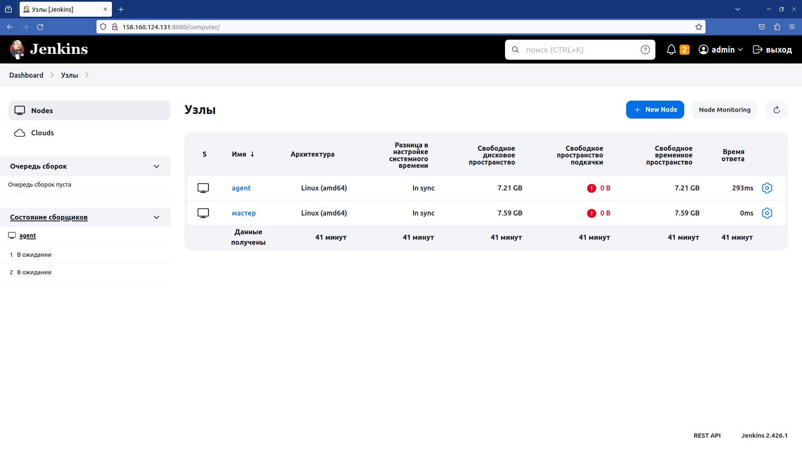

## Основная часть

1. Сделать Freestyle Job, который будет запускать `molecule test` из любого вашего репозитория с ролью.
>На выполнение данного задания мною было потрачено ограмное колличесвто времени. Описывать всего не буду - коротко. Пришлось на agent, обновлять Python до версии 3.9. обновлять зависимости, что потянуло за собой переустановку ansible и только после этого удалось провести тест без ошибок.

<details>
<summary>Скриншоты</summary>

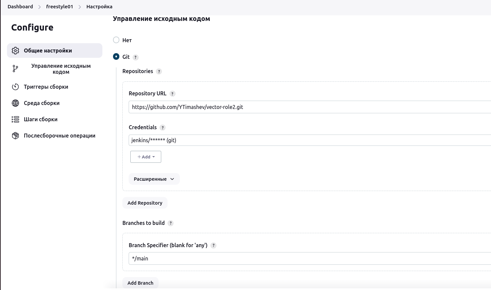

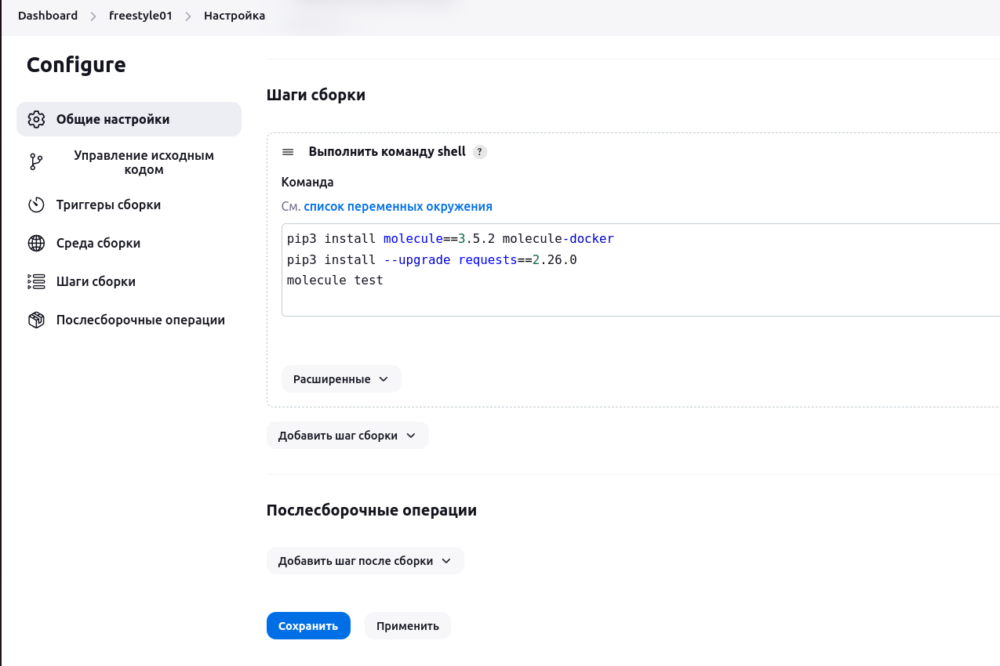

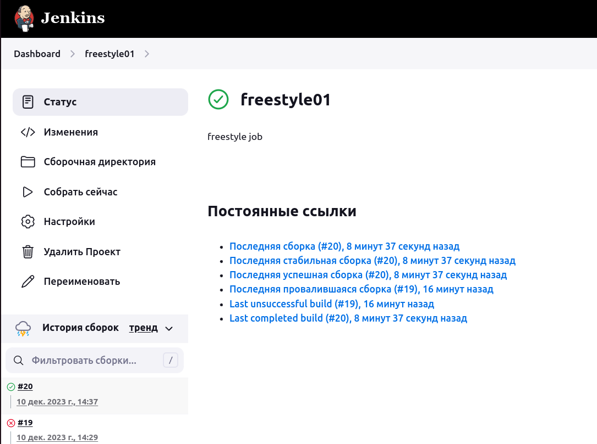

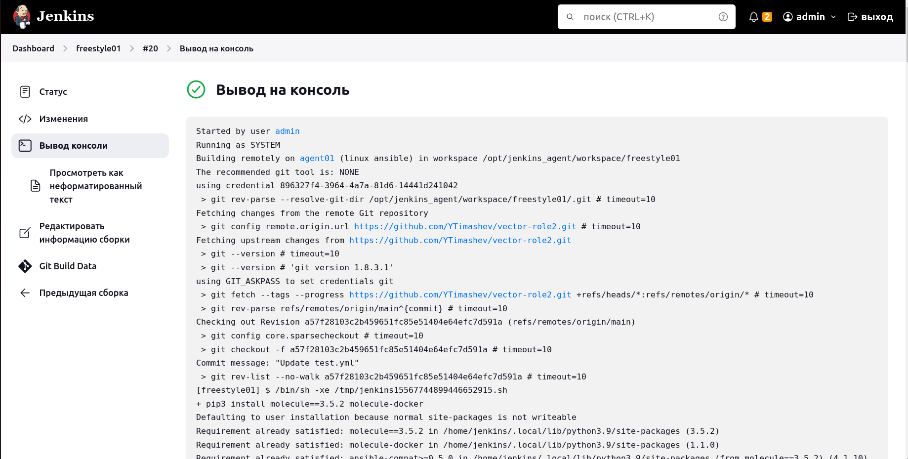

</details>

<details>
<summary>Вывод на консоль</summary>
Started by user admin
Running as SYSTEM
Building remotely on agent01 (linux ansible) in workspace /opt/jenkins_agent/workspace/freestyle01
The recommended git tool is: NONE
using credential 896327f4-3964-4a7a-81d6-14441d241042
 > git rev-parse --resolve-git-dir /opt/jenkins_agent/workspace/freestyle01/.git # timeout=10
Fetching changes from the remote Git repository
 > git config remote.origin.url https://github.com/YTimashev/vector-role2.git # timeout=10
Fetching upstream changes from https://github.com/YTimashev/vector-role2.git
 > git --version # timeout=10
 > git --version # 'git version 1.8.3.1'
using GIT_ASKPASS to set credentials git
 > git fetch --tags --progress https://github.com/YTimashev/vector-role2.git +refs/heads/*:refs/remotes/origin/* # timeout=10
 > git rev-parse refs/remotes/origin/main^{commit} # timeout=10
Checking out Revision a57f28103c2b459651fc85e51404e64efc7d591a (refs/remotes/origin/main)
 > git config core.sparsecheckout # timeout=10
 > git checkout -f a57f28103c2b459651fc85e51404e64efc7d591a # timeout=10
Commit message: "Update test.yml"
 > git rev-list --no-walk a57f28103c2b459651fc85e51404e64efc7d591a # timeout=10
[freestyle01] $ /bin/sh -xe /tmp/jenkins15567744899446652915.sh
+ pip3 install molecule==3.5.2 molecule-docker
Defaulting to user installation because normal site-packages is not writeable
Requirement already satisfied: molecule==3.5.2 in /home/jenkins/.local/lib/python3.9/site-packages (3.5.2)
Requirement already satisfied: molecule-docker in /home/jenkins/.local/lib/python3.9/site-packages (1.1.0)
Requirement already satisfied: ansible-compat>=0.5.0 in /home/jenkins/.local/lib/python3.9/site-packages (from molecule==3.5.2) (4.1.10)
Requirement already satisfied: cerberus!=1.3.3,!=1.3.4,>=1.3.1 in /home/jenkins/.local/lib/python3.9/site-packages (from molecule==3.5.2) (1.3.5)
Requirement already satisfied: click<9,>=8.0 in /home/jenkins/.local/lib/python3.9/site-packages (from molecule==3.5.2) (8.1.7)
Requirement already satisfied: click-help-colors>=0.9 in /home/jenkins/.local/lib/python3.9/site-packages (from molecule==3.5.2) (0.9.4)
Requirement already satisfied: cookiecutter>=1.7.3 in /home/jenkins/.local/lib/python3.9/site-packages (from molecule==3.5.2) (2.5.0)
Requirement already satisfied: enrich>=1.2.5 in /home/jenkins/.local/lib/python3.9/site-packages (from molecule==3.5.2) (1.2.7)
Requirement already satisfied: Jinja2>=2.11.3 in /home/jenkins/.local/lib/python3.9/site-packages (from molecule==3.5.2) (3.1.2)
Requirement already satisfied: packaging in /home/jenkins/.local/lib/python3.9/site-packages (from molecule==3.5.2) (23.2)
Requirement already satisfied: paramiko<3,>=2.5.0 in /home/jenkins/.local/lib/python3.9/site-packages (from molecule==3.5.2) (2.12.0)
Requirement already satisfied: pluggy<2.0,>=0.7.1 in /home/jenkins/.local/lib/python3.9/site-packages (from molecule==3.5.2) (1.3.0)
Requirement already satisfied: PyYAML<6,>=5.1 in /home/jenkins/.local/lib/python3.9/site-packages (from molecule==3.5.2) (5.4.1)
Requirement already satisfied: rich>=9.5.1 in /home/jenkins/.local/lib/python3.9/site-packages (from molecule==3.5.2) (13.7.0)
Requirement already satisfied: subprocess-tee>=0.3.5 in /home/jenkins/.local/lib/python3.9/site-packages (from molecule==3.5.2) (0.4.1)
Requirement already satisfied: selinux in /home/jenkins/.local/lib/python3.9/site-packages (from molecule==3.5.2) (0.3.0)
Requirement already satisfied: docker>=4.3.1 in /home/jenkins/.local/lib/python3.9/site-packages (from molecule-docker) (7.0.0)
Requirement already satisfied: requests in /home/jenkins/.local/lib/python3.9/site-packages (from molecule-docker) (2.26.0)
Requirement already satisfied: ansible-core>=2.12 in /home/jenkins/.local/lib/python3.9/site-packages (from ansible-compat>=0.5.0->molecule==3.5.2) (2.15.7)
Requirement already satisfied: jsonschema>=4.6.0 in /home/jenkins/.local/lib/python3.9/site-packages (from ansible-compat>=0.5.0->molecule==3.5.2) (4.20.0)
Requirement already satisfied: typing-extensions>=4.5.0 in /home/jenkins/.local/lib/python3.9/site-packages (from ansible-compat>=0.5.0->molecule==3.5.2) (4.9.0)
Requirement already satisfied: binaryornot>=0.4.4 in /home/jenkins/.local/lib/python3.9/site-packages (from cookiecutter>=1.7.3->molecule==3.5.2) (0.4.4)
Requirement already satisfied: python-slugify>=4.0.0 in /home/jenkins/.local/lib/python3.9/site-packages (from cookiecutter>=1.7.3->molecule==3.5.2) (8.0.1)
Requirement already satisfied: arrow in /home/jenkins/.local/lib/python3.9/site-packages (from cookiecutter>=1.7.3->molecule==3.5.2) (1.3.0)
Requirement already satisfied: urllib3>=1.26.0 in /home/jenkins/.local/lib/python3.9/site-packages (from docker>=4.3.1->molecule-docker) (1.26.6)
Requirement already satisfied: MarkupSafe>=2.0 in /home/jenkins/.local/lib/python3.9/site-packages (from Jinja2>=2.11.3->molecule==3.5.2) (2.1.3)
Requirement already satisfied: bcrypt>=3.1.3 in /home/jenkins/.local/lib/python3.9/site-packages (from paramiko<3,>=2.5.0->molecule==3.5.2) (4.1.1)
Requirement already satisfied: cryptography>=2.5 in /home/jenkins/.local/lib/python3.9/site-packages (from paramiko<3,>=2.5.0->molecule==3.5.2) (41.0.7)
Requirement already satisfied: pynacl>=1.0.1 in /home/jenkins/.local/lib/python3.9/site-packages (from paramiko<3,>=2.5.0->molecule==3.5.2) (1.5.0)
Requirement already satisfied: six in /home/jenkins/.local/lib/python3.9/site-packages (from paramiko<3,>=2.5.0->molecule==3.5.2) (1.16.0)
Requirement already satisfied: certifi>=2017.4.17 in /home/jenkins/.local/lib/python3.9/site-packages (from requests->molecule-docker) (2023.11.17)
Requirement already satisfied: charset-normalizer~=2.0.0 in /home/jenkins/.local/lib/python3.9/site-packages (from requests->molecule-docker) (2.0.12)
Requirement already satisfied: idna<4,>=2.5 in /home/jenkins/.local/lib/python3.9/site-packages (from requests->molecule-docker) (3.6)
Requirement already satisfied: markdown-it-py>=2.2.0 in /home/jenkins/.local/lib/python3.9/site-packages (from rich>=9.5.1->molecule==3.5.2) (3.0.0)
Requirement already satisfied: pygments<3.0.0,>=2.13.0 in /home/jenkins/.local/lib/python3.9/site-packages (from rich>=9.5.1->molecule==3.5.2) (2.17.2)
Requirement already satisfied: distro>=1.3.0 in /home/jenkins/.local/lib/python3.9/site-packages (from selinux->molecule==3.5.2) (1.8.0)
Requirement already satisfied: resolvelib<1.1.0,>=0.5.3 in /home/jenkins/.local/lib/python3.9/site-packages (from ansible-core>=2.12->ansible-compat>=0.5.0->molecule==3.5.2) (1.0.1)
Requirement already satisfied: importlib-resources<5.1,>=5.0 in /home/jenkins/.local/lib/python3.9/site-packages (from ansible-core>=2.12->ansible-compat>=0.5.0->molecule==3.5.2) (5.0.7)
Requirement already satisfied: chardet>=3.0.2 in /home/jenkins/.local/lib/python3.9/site-packages (from binaryornot>=0.4.4->cookiecutter>=1.7.3->molecule==3.5.2) (5.2.0)
Requirement already satisfied: cffi>=1.12 in /home/jenkins/.local/lib/python3.9/site-packages (from cryptography>=2.5->paramiko<3,>=2.5.0->molecule==3.5.2) (1.16.0)
Requirement already satisfied: attrs>=22.2.0 in /home/jenkins/.local/lib/python3.9/site-packages (from jsonschema>=4.6.0->ansible-compat>=0.5.0->molecule==3.5.2) (23.1.0)
Requirement already satisfied: jsonschema-specifications>=2023.03.6 in /home/jenkins/.local/lib/python3.9/site-packages (from jsonschema>=4.6.0->ansible-compat>=0.5.0->molecule==3.5.2) (2023.11.2)
Requirement already satisfied: referencing>=0.28.4 in /home/jenkins/.local/lib/python3.9/site-packages (from jsonschema>=4.6.0->ansible-compat>=0.5.0->molecule==3.5.2) (0.32.0)
Requirement already satisfied: rpds-py>=0.7.1 in /home/jenkins/.local/lib/python3.9/site-packages (from jsonschema>=4.6.0->ansible-compat>=0.5.0->molecule==3.5.2) (0.13.2)
Requirement already satisfied: mdurl~=0.1 in /home/jenkins/.local/lib/python3.9/site-packages (from markdown-it-py>=2.2.0->rich>=9.5.1->molecule==3.5.2) (0.1.2)
Requirement already satisfied: text-unidecode>=1.3 in /home/jenkins/.local/lib/python3.9/site-packages (from python-slugify>=4.0.0->cookiecutter>=1.7.3->molecule==3.5.2) (1.3)
Requirement already satisfied: python-dateutil>=2.7.0 in /home/jenkins/.local/lib/python3.9/site-packages (from arrow->cookiecutter>=1.7.3->molecule==3.5.2) (2.8.2)
Requirement already satisfied: types-python-dateutil>=2.8.10 in /home/jenkins/.local/lib/python3.9/site-packages (from arrow->cookiecutter>=1.7.3->molecule==3.5.2) (2.8.19.14)
Requirement already satisfied: pycparser in /home/jenkins/.local/lib/python3.9/site-packages (from cffi>=1.12->cryptography>=2.5->paramiko<3,>=2.5.0->molecule==3.5.2) (2.21)
+ pip3 install --upgrade requests==2.26.0
Defaulting to user installation because normal site-packages is not writeable
Requirement already satisfied: requests==2.26.0 in /home/jenkins/.local/lib/python3.9/site-packages (2.26.0)
Requirement already satisfied: urllib3<1.27,>=1.21.1 in /home/jenkins/.local/lib/python3.9/site-packages (from requests==2.26.0) (1.26.6)
Requirement already satisfied: certifi>=2017.4.17 in /home/jenkins/.local/lib/python3.9/site-packages (from requests==2.26.0) (2023.11.17)
Requirement already satisfied: charset-normalizer~=2.0.0 in /home/jenkins/.local/lib/python3.9/site-packages (from requests==2.26.0) (2.0.12)
Requirement already satisfied: idna<4,>=2.5 in /home/jenkins/.local/lib/python3.9/site-packages (from requests==2.26.0) (3.6)
+ molecule test
Failed to load driver entry point Traceback (most recent call last):
  File "/home/jenkins/.local/lib/python3.9/site-packages/molecule/api.py", line 53, in drivers
    pm.load_setuptools_entrypoints("molecule.driver")
  File "/home/jenkins/.local/lib/python3.9/site-packages/pluggy/_manager.py", line 399, in load_setuptools_entrypoints
    self.register(plugin, name=ep.name)
  File "/home/jenkins/.local/lib/python3.9/site-packages/pluggy/_manager.py", line 141, in register
    raise ValueError(
ValueError: Plugin already registered under a different name: default=<class 'molecule.driver.delegated.Delegated'>
{'delegated': <class 'molecule.driver.delegated.Delegated'>, 'docker': <class 'molecule_docker.driver.Docker'>}

/home/jenkins/.local/lib/python3.9/site-packages/requests/__init__.py:102: RequestsDependencyWarning: urllib3 (1.26.6) or chardet (5.2.0)/charset_normalizer (2.0.12) doesn't match a supported version!
  warnings.warn("urllib3 ({}) or chardet ({})/charset_normalizer ({}) doesn't match a supported "
ERROR    Failed to load driver entry point Traceback (most recent call last):
  File "/home/jenkins/.local/lib/python3.9/site-packages/molecule/api.py", line 53, in drivers
    pm.load_setuptools_entrypoints("molecule.driver")
  File "/home/jenkins/.local/lib/python3.9/site-packages/pluggy/_manager.py", line 399, in load_setuptools_entrypoints
    self.register(plugin, name=ep.name)
  File "/home/jenkins/.local/lib/python3.9/site-packages/pluggy/_manager.py", line 141, in register
    raise ValueError(
ValueError: Plugin already registered under a different name: default=<class 'molecule.driver.delegated.Delegated'>
{'delegated': <class 'molecule.driver.delegated.Delegated'>, 'docker': <class 'molecule_docker.driver.Docker'>}

INFO     default scenario test matrix: destroy, create, converge, destroy
INFO     Performing prerun...
INFO     Set ANSIBLE_LIBRARY=/home/jenkins/.cache/ansible-compat/c53e15/modules:/home/jenkins/.ansible/plugins/modules:/usr/share/ansible/plugins/modules
INFO     Set ANSIBLE_COLLECTIONS_PATH=/home/jenkins/.cache/ansible-compat/c53e15/collections:/home/jenkins/.ansible/collections:/usr/share/ansible/collections
INFO     Set ANSIBLE_ROLES_PATH=/home/jenkins/.cache/ansible-compat/c53e15/roles:/home/jenkins/.ansible/roles:/usr/share/ansible/roles:/etc/ansible/roles
INFO     Running default > destroy
INFO     Sanity checks: 'docker'

PLAY [Destroy] *****************************************************************

TASK [Destroy molecule instance(s)] ********************************************
changed: [localhost] => (item=ubuntu)

TASK [Wait for instance(s) deletion to complete] *******************************
FAILED - RETRYING: [localhost]: Wait for instance(s) deletion to complete (300 retries left).
ok: [localhost] => (item=ubuntu)

TASK [Delete docker networks(s)] ***********************************************
skipping: [localhost]

PLAY RECAP *********************************************************************
localhost                  : ok=2    changed=1    unreachable=0    failed=0    skipped=1    rescued=0    ignored=0

INFO     Running default > create

PLAY [Create] ******************************************************************

TASK [Log into a Docker registry] **********************************************
skipping: [localhost] => (item=None)
skipping: [localhost]

TASK [Check presence of custom Dockerfiles] ************************************
ok: [localhost] => (item={'image': 'docker.io/pycontribs/ubuntu:latest', 'name': 'ubuntu', 'pre_build_image': True})

TASK [Create Dockerfiles from image names] *************************************
skipping: [localhost] => (item={'image': 'docker.io/pycontribs/ubuntu:latest', 'name': 'ubuntu', 'pre_build_image': True})
skipping: [localhost]

TASK [Discover local Docker images] ********************************************
ok: [localhost] => (item={'changed': False, 'skipped': True, 'skip_reason': 'Conditional result was False', 'false_condition': 'not item.pre_build_image | default(false)', 'item': {'image': 'docker.io/pycontribs/ubuntu:latest', 'name': 'ubuntu', 'pre_build_image': True}, 'ansible_loop_var': 'item', 'i': 0, 'ansible_index_var': 'i'})

TASK [Build an Ansible compatible image (new)] *********************************
skipping: [localhost] => (item=molecule_local/docker.io/pycontribs/ubuntu:latest)
skipping: [localhost]

TASK [Create docker network(s)] ************************************************
skipping: [localhost]

TASK [Determine the CMD directives] ********************************************
ok: [localhost] => (item={'image': 'docker.io/pycontribs/ubuntu:latest', 'name': 'ubuntu', 'pre_build_image': True})

TASK [Create molecule instance(s)] *********************************************
changed: [localhost] => (item=ubuntu)

TASK [Wait for instance(s) creation to complete] *******************************
FAILED - RETRYING: [localhost]: Wait for instance(s) creation to complete (300 retries left).
FAILED - RETRYING: [localhost]: Wait for instance(s) creation to complete (299 retries left).
FAILED - RETRYING: [localhost]: Wait for instance(s) creation to complete (298 retries left).
FAILED - RETRYING: [localhost]: Wait for instance(s) creation to complete (297 retries left).
FAILED - RETRYING: [localhost]: Wait for instance(s) creation to complete (296 retries left).
FAILED - RETRYING: [localhost]: Wait for instance(s) creation to complete (295 retries left).
FAILED - RETRYING: [localhost]: Wait for instance(s) creation to complete (294 retries left).
FAILED - RETRYING: [localhost]: Wait for instance(s) creation to complete (293 retries left).
FAILED - RETRYING: [localhost]: Wait for instance(s) creation to complete (292 retries left).
changed: [localhost] => (item={'failed': 0, 'started': 1, 'finished': 0, 'ansible_job_id': 'j880155852528.12667', 'results_file': '/home/jenkins/.ansible_async/j880155852528.12667', 'changed': True, 'item': {'image': 'docker.io/pycontribs/ubuntu:latest', 'name': 'ubuntu', 'pre_build_image': True}, 'ansible_loop_var': 'item'})

PLAY RECAP *********************************************************************
localhost                  : ok=5    changed=2    unreachable=0    failed=0    skipped=4    rescued=0    ignored=0

INFO     Running default > converge

PLAY [Converge] ****************************************************************

TASK [Gathering Facts] *********************************************************
ok: [ubuntu]

TASK [Include vector-role2] ****************************************************

TASK [vector-role2 : Get Vector distrib | CentOS] ******************************
skipping: [ubuntu]

TASK [vector-role2 : Get Vector distrib | Ubuntu] ******************************
changed: [ubuntu]

TASK [vector-role2 : Install Vector packages | CentOS] *************************
skipping: [ubuntu]

TASK [vector-role2 : Install Vector packages | Ubuntu] *************************
changed: [ubuntu]

TASK [vector-role2 : Deploy config Vector] *************************************
changed: [ubuntu]

TASK [vector-role2 : Creates directory] ****************************************
changed: [ubuntu]

TASK [vector-role2 : Create systemd unit Vector] *******************************
changed: [ubuntu]

RUNNING HANDLER [vector-role2 : Start Vector service] **************************
skipping: [ubuntu]

PLAY RECAP *********************************************************************
ubuntu                     : ok=6    changed=5    unreachable=0    failed=0    skipped=3    rescued=0    ignored=0

INFO     Running default > destroy

PLAY [Destroy] *****************************************************************

TASK [Destroy molecule instance(s)] ********************************************
changed: [localhost] => (item=ubuntu)

TASK [Wait for instance(s) deletion to complete] *******************************
FAILED - RETRYING: [localhost]: Wait for instance(s) deletion to complete (300 retries left).
changed: [localhost] => (item=ubuntu)

TASK [Delete docker networks(s)] ***********************************************
skipping: [localhost]

PLAY RECAP *********************************************************************
localhost                  : ok=2    changed=2    unreachable=0    failed=0    skipped=1    rescued=0    ignored=0

INFO     Pruning extra files from scenario ephemeral directory
Finished: SUCCESS

</details>

2. Сделать Declarative Pipeline Job, который будет запускать `molecule test` из любого вашего репозитория с ролью.

<details>
<summary>Скриншоты</summary>

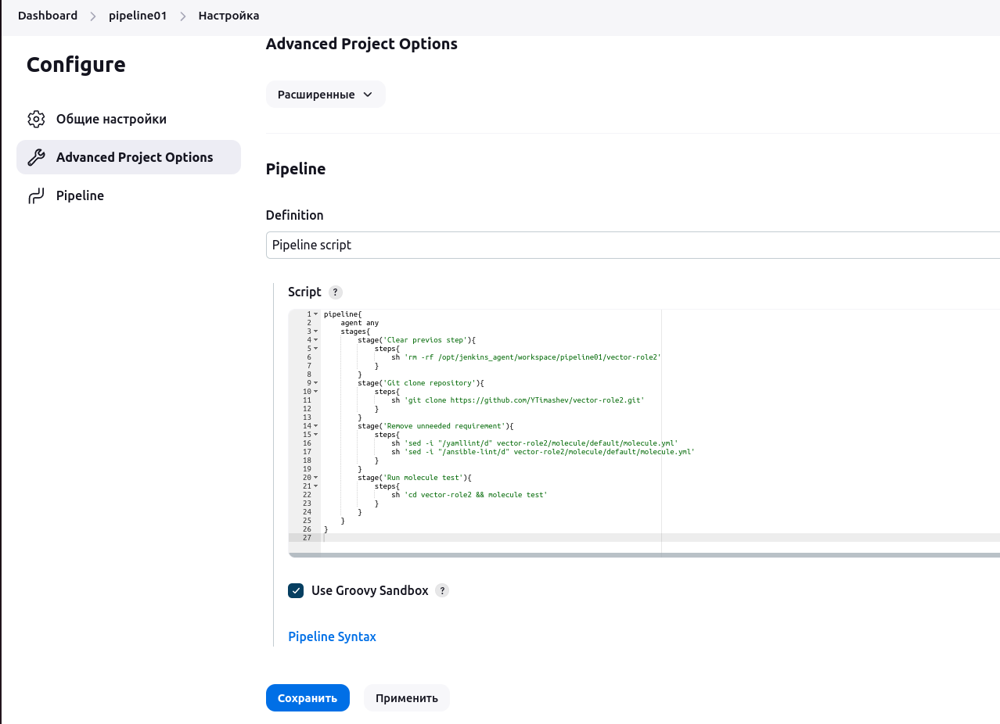

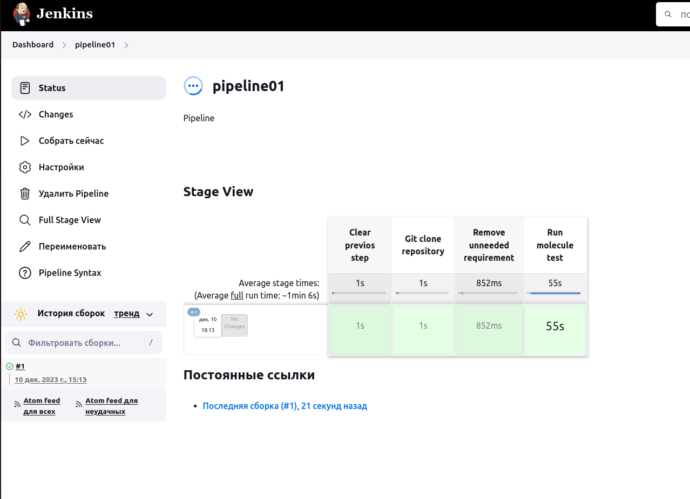

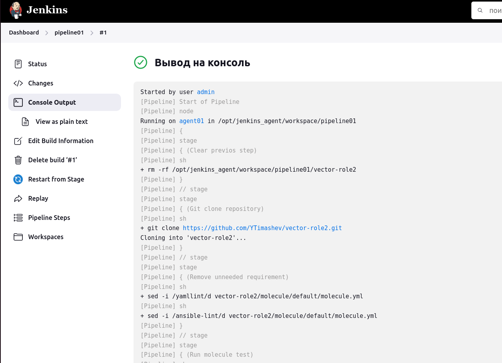

</details>

<details>
<summary>Вывод на консоль</summary>

Started by user admin
[Pipeline] Start of Pipeline
[Pipeline] node
Running on agent01 in /opt/jenkins_agent/workspace/pipeline01
[Pipeline] {
[Pipeline] stage
[Pipeline] { (Clear previos step)
[Pipeline] sh
+ rm -rf /opt/jenkins_agent/workspace/pipeline01/vector-role2
[Pipeline] }
[Pipeline] // stage
[Pipeline] stage
[Pipeline] { (Git clone repository)
[Pipeline] sh
+ git clone https://github.com/YTimashev/vector-role2.git
Cloning into 'vector-role2'...
[Pipeline] }
[Pipeline] // stage
[Pipeline] stage
[Pipeline] { (Remove unneeded requirement)
[Pipeline] sh
+ sed -i /yamllint/d vector-role2/molecule/default/molecule.yml
[Pipeline] sh
+ sed -i /ansible-lint/d vector-role2/molecule/default/molecule.yml
[Pipeline] }
[Pipeline] // stage
[Pipeline] stage
[Pipeline] { (Run molecule test)
[Pipeline] sh
+ cd vector-role2
+ molecule test
Failed to load driver entry point Traceback (most recent call last):
  File "/home/jenkins/.local/lib/python3.9/site-packages/molecule/api.py", line 53, in drivers
    pm.load_setuptools_entrypoints("molecule.driver")
  File "/home/jenkins/.local/lib/python3.9/site-packages/pluggy/_manager.py", line 399, in load_setuptools_entrypoints
    self.register(plugin, name=ep.name)
  File "/home/jenkins/.local/lib/python3.9/site-packages/pluggy/_manager.py", line 141, in register
    raise ValueError(
ValueError: Plugin already registered under a different name: default=<class 'molecule.driver.delegated.Delegated'>
{'delegated': <class 'molecule.driver.delegated.Delegated'>, 'docker': <class 'molecule_docker.driver.Docker'>}

/home/jenkins/.local/lib/python3.9/site-packages/requests/__init__.py:102: RequestsDependencyWarning: urllib3 (1.26.6) or chardet (5.2.0)/charset_normalizer (2.0.12) doesn't match a supported version!
  warnings.warn("urllib3 ({}) or chardet ({})/charset_normalizer ({}) doesn't match a supported "
ERROR    Failed to load driver entry point Traceback (most recent call last):
  File "/home/jenkins/.local/lib/python3.9/site-packages/molecule/api.py", line 53, in drivers
    pm.load_setuptools_entrypoints("molecule.driver")
  File "/home/jenkins/.local/lib/python3.9/site-packages/pluggy/_manager.py", line 399, in load_setuptools_entrypoints
    self.register(plugin, name=ep.name)
  File "/home/jenkins/.local/lib/python3.9/site-packages/pluggy/_manager.py", line 141, in register
    raise ValueError(
ValueError: Plugin already registered under a different name: default=<class 'molecule.driver.delegated.Delegated'>
{'delegated': <class 'molecule.driver.delegated.Delegated'>, 'docker': <class 'molecule_docker.driver.Docker'>}

INFO     default scenario test matrix: destroy, create, converge, destroy
INFO     Performing prerun...
INFO     Set ANSIBLE_LIBRARY=/home/jenkins/.cache/ansible-compat/47a107/modules:/home/jenkins/.ansible/plugins/modules:/usr/share/ansible/plugins/modules
INFO     Set ANSIBLE_COLLECTIONS_PATH=/home/jenkins/.cache/ansible-compat/47a107/collections:/home/jenkins/.ansible/collections:/usr/share/ansible/collections
INFO     Set ANSIBLE_ROLES_PATH=/home/jenkins/.cache/ansible-compat/47a107/roles:/home/jenkins/.ansible/roles:/usr/share/ansible/roles:/etc/ansible/roles
INFO     Running default > destroy
INFO     Sanity checks: 'docker'

PLAY [Destroy] *****************************************************************

TASK [Destroy molecule instance(s)] ********************************************
changed: [localhost] => (item=ubuntu)

TASK [Wait for instance(s) deletion to complete] *******************************
FAILED - RETRYING: [localhost]: Wait for instance(s) deletion to complete (300 retries left).
ok: [localhost] => (item=ubuntu)

TASK [Delete docker networks(s)] ***********************************************
skipping: [localhost]

PLAY RECAP *********************************************************************
localhost                  : ok=2    changed=1    unreachable=0    failed=0    skipped=1    rescued=0    ignored=0

INFO     Running default > create

PLAY [Create] ******************************************************************

TASK [Log into a Docker registry] **********************************************
skipping: [localhost] => (item=None)
skipping: [localhost]

TASK [Check presence of custom Dockerfiles] ************************************
ok: [localhost] => (item={'image': 'docker.io/pycontribs/ubuntu:latest', 'name': 'ubuntu', 'pre_build_image': True})

TASK [Create Dockerfiles from image names] *************************************
skipping: [localhost] => (item={'image': 'docker.io/pycontribs/ubuntu:latest', 'name': 'ubuntu', 'pre_build_image': True})
skipping: [localhost]

TASK [Discover local Docker images] ********************************************
ok: [localhost] => (item={'changed': False, 'skipped': True, 'skip_reason': 'Conditional result was False', 'false_condition': 'not item.pre_build_image | default(false)', 'item': {'image': 'docker.io/pycontribs/ubuntu:latest', 'name': 'ubuntu', 'pre_build_image': True}, 'ansible_loop_var': 'item', 'i': 0, 'ansible_index_var': 'i'})

TASK [Build an Ansible compatible image (new)] *********************************
skipping: [localhost] => (item=molecule_local/docker.io/pycontribs/ubuntu:latest)
skipping: [localhost]

TASK [Create docker network(s)] ************************************************
skipping: [localhost]

TASK [Determine the CMD directives] ********************************************
ok: [localhost] => (item={'image': 'docker.io/pycontribs/ubuntu:latest', 'name': 'ubuntu', 'pre_build_image': True})

TASK [Create molecule instance(s)] *********************************************
changed: [localhost] => (item=ubuntu)

TASK [Wait for instance(s) creation to complete] *******************************
FAILED - RETRYING: [localhost]: Wait for instance(s) creation to complete (300 retries left).
changed: [localhost] => (item={'failed': 0, 'started': 1, 'finished': 0, 'ansible_job_id': 'j631471798424.14676', 'results_file': '/home/jenkins/.ansible_async/j631471798424.14676', 'changed': True, 'item': {'image': 'docker.io/pycontribs/ubuntu:latest', 'name': 'ubuntu', 'pre_build_image': True}, 'ansible_loop_var': 'item'})

PLAY RECAP *********************************************************************
localhost                  : ok=5    changed=2    unreachable=0    failed=0    skipped=4    rescued=0    ignored=0

INFO     Running default > converge

PLAY [Converge] ****************************************************************

TASK [Gathering Facts] *********************************************************
ok: [ubuntu]

TASK [Include vector-role2] ****************************************************

TASK [vector-role2 : Get Vector distrib | CentOS] ******************************
skipping: [ubuntu]

TASK [vector-role2 : Get Vector distrib | Ubuntu] ******************************
changed: [ubuntu]

TASK [vector-role2 : Install Vector packages | CentOS] *************************
skipping: [ubuntu]

TASK [vector-role2 : Install Vector packages | Ubuntu] *************************
changed: [ubuntu]

TASK [vector-role2 : Deploy config Vector] *************************************
changed: [ubuntu]

TASK [vector-role2 : Creates directory] ****************************************
changed: [ubuntu]

TASK [vector-role2 : Create systemd unit Vector] *******************************
changed: [ubuntu]

RUNNING HANDLER [vector-role2 : Start Vector service] **************************
skipping: [ubuntu]

PLAY RECAP *********************************************************************
ubuntu                     : ok=6    changed=5    unreachable=0    failed=0    skipped=3    rescued=0    ignored=0

INFO     Running default > destroy

PLAY [Destroy] *****************************************************************

TASK [Destroy molecule instance(s)] ********************************************
changed: [localhost] => (item=ubuntu)

TASK [Wait for instance(s) deletion to complete] *******************************
FAILED - RETRYING: [localhost]: Wait for instance(s) deletion to complete (300 retries left).
changed: [localhost] => (item=ubuntu)

TASK [Delete docker networks(s)] ***********************************************
skipping: [localhost]

PLAY RECAP *********************************************************************
localhost                  : ok=2    changed=2    unreachable=0    failed=0    skipped=1    rescued=0    ignored=0

INFO     Pruning extra files from scenario ephemeral directory
[Pipeline] }
[Pipeline] // stage
[Pipeline] }
[Pipeline] // node
[Pipeline] End of Pipeline
Finished: SUCCESS

</details>

3. Перенести Declarative Pipeline в репозиторий в файл `Jenkinsfile`.
[jenkinsfile](https://github.com/YTimashev/vector-role2/blob/main/pipeline/jenkinsfile)

4. Создать Multibranch Pipeline на запуск `Jenkinsfile` из репозитория.

<details>
<summary>Скриншоты</summary>

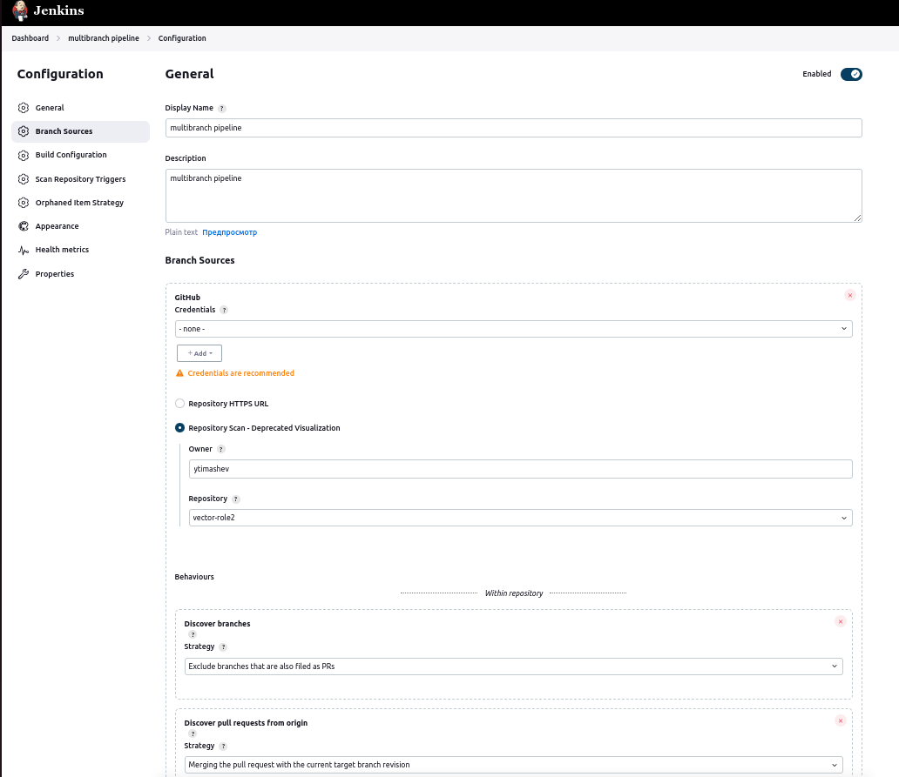

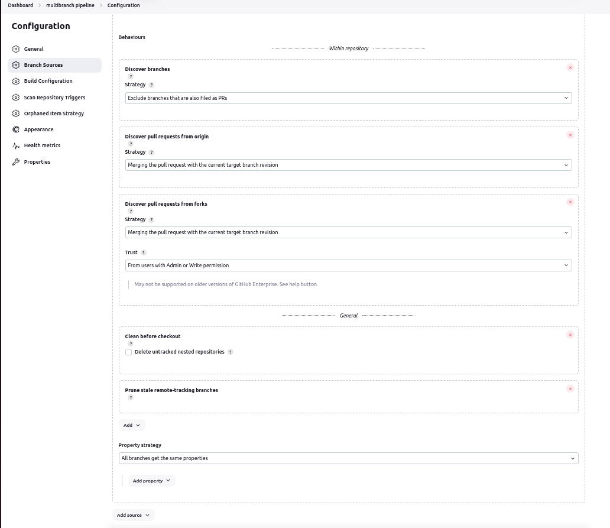

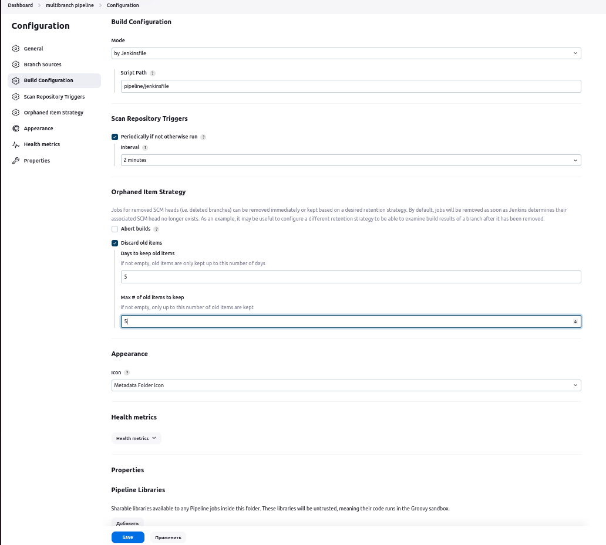

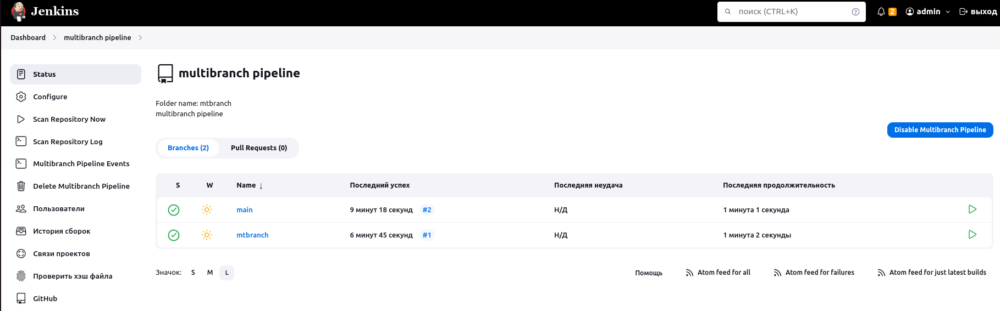

</details>

<details>
<summary>Вывод на консоль</summary>

Branch indexing
17:14:18 Connecting to https://api.github.com with no credentials, anonymous access
Obtained pipeline/jenkinsfile from 2cb12189d9f384563d859f9a9f7c6aa18f66ee27
[Pipeline] Start of Pipeline
[Pipeline] node
Running on agent01 in /opt/jenkins_agent/workspace/mtbranch_mtbranch
[Pipeline] {
[Pipeline] stage
[Pipeline] { (Declarative: Checkout SCM)
[Pipeline] checkout
The recommended git tool is: NONE
No credentials specified
Cloning the remote Git repository
Cloning with configured refspecs honoured and without tags
Avoid second fetch
Checking out Revision 2cb12189d9f384563d859f9a9f7c6aa18f66ee27 (mtbranch)
Commit message: "add jenkinsfile"
First time build. Skipping changelog.
Cloning repository https://github.com/ytimashev/vector-role2.git
 > git init /opt/jenkins_agent/workspace/mtbranch_mtbranch # timeout=10
Fetching upstream changes from https://github.com/ytimashev/vector-role2.git
 > git --version # timeout=10
 > git --version # 'git version 1.8.3.1'
 > git fetch --no-tags --progress https://github.com/ytimashev/vector-role2.git +refs/heads/mtbranch:refs/remotes/origin/mtbranch # timeout=10
 > git config remote.origin.url https://github.com/ytimashev/vector-role2.git # timeout=10
 > git config --add remote.origin.fetch +refs/heads/mtbranch:refs/remotes/origin/mtbranch # timeout=10
 > git config core.sparsecheckout # timeout=10
 > git checkout -f 2cb12189d9f384563d859f9a9f7c6aa18f66ee27 # timeout=10
[Pipeline] }
[Pipeline] // stage
[Pipeline] withEnv
[Pipeline] {
[Pipeline] stage
[Pipeline] { (Get role)
[Pipeline] dir
Running in /opt/jenkins_agent/workspace/mtbranch_mtbranch/vector-role2
[Pipeline] {
[Pipeline] git
The recommended git tool is: NONE
No credentials specified
Cloning the remote Git repository
Avoid second fetch
Checking out Revision 2cb12189d9f384563d859f9a9f7c6aa18f66ee27 (refs/remotes/origin/main)
Commit message: "add jenkinsfile"
First time build. Skipping changelog.
[Pipeline] }
Cloning repository https://github.com/YTimashev/vector-role2.git
 > git init /opt/jenkins_agent/workspace/mtbranch_mtbranch/vector-role2 # timeout=10
Fetching upstream changes from https://github.com/YTimashev/vector-role2.git
 > git --version # timeout=10
 > git --version # 'git version 1.8.3.1'
 > git fetch --tags --progress https://github.com/YTimashev/vector-role2.git +refs/heads/*:refs/remotes/origin/* # timeout=10
 > git config remote.origin.url https://github.com/YTimashev/vector-role2.git # timeout=10
 > git config --add remote.origin.fetch +refs/heads/*:refs/remotes/origin/* # timeout=10
 > git rev-parse refs/remotes/origin/main^{commit} # timeout=10
 > git config core.sparsecheckout # timeout=10
 > git checkout -f 2cb12189d9f384563d859f9a9f7c6aa18f66ee27 # timeout=10
 > git branch -a -v --no-abbrev # timeout=10
 > git checkout -b main 2cb12189d9f384563d859f9a9f7c6aa18f66ee27 # timeout=10
[Pipeline] // dir
[Pipeline] }
[Pipeline] // stage
[Pipeline] stage
[Pipeline] { (Test role)
[Pipeline] sh
+ molecule test
Failed to load driver entry point Traceback (most recent call last):
  File "/home/jenkins/.local/lib/python3.9/site-packages/molecule/api.py", line 53, in drivers
    pm.load_setuptools_entrypoints("molecule.driver")
  File "/home/jenkins/.local/lib/python3.9/site-packages/pluggy/_manager.py", line 399, in load_setuptools_entrypoints
    self.register(plugin, name=ep.name)
  File "/home/jenkins/.local/lib/python3.9/site-packages/pluggy/_manager.py", line 141, in register
    raise ValueError(
ValueError: Plugin already registered under a different name: default=<class 'molecule.driver.delegated.Delegated'>
{'delegated': <class 'molecule.driver.delegated.Delegated'>, 'docker': <class 'molecule_docker.driver.Docker'>}

/home/jenkins/.local/lib/python3.9/site-packages/requests/__init__.py:102: RequestsDependencyWarning: urllib3 (1.26.6) or chardet (5.2.0)/charset_normalizer (2.0.12) doesn't match a supported version!
  warnings.warn("urllib3 ({}) or chardet ({})/charset_normalizer ({}) doesn't match a supported "
ERROR    Failed to load driver entry point Traceback (most recent call last):
  File "/home/jenkins/.local/lib/python3.9/site-packages/molecule/api.py", line 53, in drivers
    pm.load_setuptools_entrypoints("molecule.driver")
  File "/home/jenkins/.local/lib/python3.9/site-packages/pluggy/_manager.py", line 399, in load_setuptools_entrypoints
    self.register(plugin, name=ep.name)
  File "/home/jenkins/.local/lib/python3.9/site-packages/pluggy/_manager.py", line 141, in register
    raise ValueError(
ValueError: Plugin already registered under a different name: default=<class 'molecule.driver.delegated.Delegated'>
{'delegated': <class 'molecule.driver.delegated.Delegated'>, 'docker': <class 'molecule_docker.driver.Docker'>}

INFO     default scenario test matrix: destroy, create, converge, destroy
INFO     Performing prerun...
INFO     Set ANSIBLE_LIBRARY=/home/jenkins/.cache/ansible-compat/df58c9/modules:/home/jenkins/.ansible/plugins/modules:/usr/share/ansible/plugins/modules
INFO     Set ANSIBLE_COLLECTIONS_PATH=/home/jenkins/.cache/ansible-compat/df58c9/collections:/home/jenkins/.ansible/collections:/usr/share/ansible/collections
INFO     Set ANSIBLE_ROLES_PATH=/home/jenkins/.cache/ansible-compat/df58c9/roles:/home/jenkins/.ansible/roles:/usr/share/ansible/roles:/etc/ansible/roles
INFO     Running default > destroy
INFO     Sanity checks: 'docker'

PLAY [Destroy] *****************************************************************

TASK [Destroy molecule instance(s)] ********************************************
changed: [localhost] => (item=ubuntu)

TASK [Wait for instance(s) deletion to complete] *******************************
FAILED - RETRYING: [localhost]: Wait for instance(s) deletion to complete (300 retries left).
ok: [localhost] => (item=ubuntu)

TASK [Delete docker networks(s)] ***********************************************
skipping: [localhost]

PLAY RECAP *********************************************************************
localhost                  : ok=2    changed=1    unreachable=0    failed=0    skipped=1    rescued=0    ignored=0

INFO     Running default > create

PLAY [Create] ******************************************************************

TASK [Log into a Docker registry] **********************************************
skipping: [localhost] => (item=None)
skipping: [localhost]

TASK [Check presence of custom Dockerfiles] ************************************
ok: [localhost] => (item={'image': 'docker.io/pycontribs/ubuntu:latest', 'name': 'ubuntu', 'pre_build_image': True})

TASK [Create Dockerfiles from image names] *************************************
skipping: [localhost] => (item={'image': 'docker.io/pycontribs/ubuntu:latest', 'name': 'ubuntu', 'pre_build_image': True})
skipping: [localhost]

TASK [Discover local Docker images] ********************************************
ok: [localhost] => (item={'changed': False, 'skipped': True, 'skip_reason': 'Conditional result was False', 'false_condition': 'not item.pre_build_image | default(false)', 'item': {'image': 'docker.io/pycontribs/ubuntu:latest', 'name': 'ubuntu', 'pre_build_image': True}, 'ansible_loop_var': 'item', 'i': 0, 'ansible_index_var': 'i'})

TASK [Build an Ansible compatible image (new)] *********************************
skipping: [localhost] => (item=molecule_local/docker.io/pycontribs/ubuntu:latest)
skipping: [localhost]

TASK [Create docker network(s)] ************************************************
skipping: [localhost]

TASK [Determine the CMD directives] ********************************************
ok: [localhost] => (item={'image': 'docker.io/pycontribs/ubuntu:latest', 'name': 'ubuntu', 'pre_build_image': True})

TASK [Create molecule instance(s)] *********************************************
changed: [localhost] => (item=ubuntu)

TASK [Wait for instance(s) creation to complete] *******************************
FAILED - RETRYING: [localhost]: Wait for instance(s) creation to complete (300 retries left).
changed: [localhost] => (item={'failed': 0, 'started': 1, 'finished': 0, 'ansible_job_id': 'j443063799866.20320', 'results_file': '/home/jenkins/.ansible_async/j443063799866.20320', 'changed': True, 'item': {'image': 'docker.io/pycontribs/ubuntu:latest', 'name': 'ubuntu', 'pre_build_image': True}, 'ansible_loop_var': 'item'})

PLAY RECAP *********************************************************************
localhost                  : ok=5    changed=2    unreachable=0    failed=0    skipped=4    rescued=0    ignored=0

INFO     Running default > converge

PLAY [Converge] ****************************************************************

TASK [Gathering Facts] *********************************************************
ok: [ubuntu]

TASK [Include vector-role2] ****************************************************

TASK [vector-role2 : Get Vector distrib | CentOS] ******************************
skipping: [ubuntu]

TASK [vector-role2 : Get Vector distrib | Ubuntu] ******************************
changed: [ubuntu]

TASK [vector-role2 : Install Vector packages | CentOS] *************************
skipping: [ubuntu]

TASK [vector-role2 : Install Vector packages | Ubuntu] *************************
changed: [ubuntu]

TASK [vector-role2 : Deploy config Vector] *************************************
changed: [ubuntu]

TASK [vector-role2 : Creates directory] ****************************************
changed: [ubuntu]

TASK [vector-role2 : Create systemd unit Vector] *******************************
changed: [ubuntu]

RUNNING HANDLER [vector-role2 : Start Vector service] **************************
skipping: [ubuntu]

PLAY RECAP *********************************************************************
ubuntu                     : ok=6    changed=5    unreachable=0    failed=0    skipped=3    rescued=0    ignored=0

INFO     Running default > destroy

PLAY [Destroy] *****************************************************************

TASK [Destroy molecule instance(s)] ********************************************
changed: [localhost] => (item=ubuntu)

TASK [Wait for instance(s) deletion to complete] *******************************
FAILED - RETRYING: [localhost]: Wait for instance(s) deletion to complete (300 retries left).
changed: [localhost] => (item=ubuntu)

TASK [Delete docker networks(s)] ***********************************************
skipping: [localhost]

PLAY RECAP *********************************************************************
localhost                  : ok=2    changed=2    unreachable=0    failed=0    skipped=1    rescued=0    ignored=0

INFO     Pruning extra files from scenario ephemeral directory
[Pipeline] }
[Pipeline] // stage
[Pipeline] }
[Pipeline] // withEnv
[Pipeline] }
[Pipeline] // node
[Pipeline] End of Pipeline
Finished: SUCCESS

</details>

5. Создать Scripted Pipeline, наполнить его скриптом из [pipeline](./pipeline).

<details>
<summary>Скриншоты</summary>

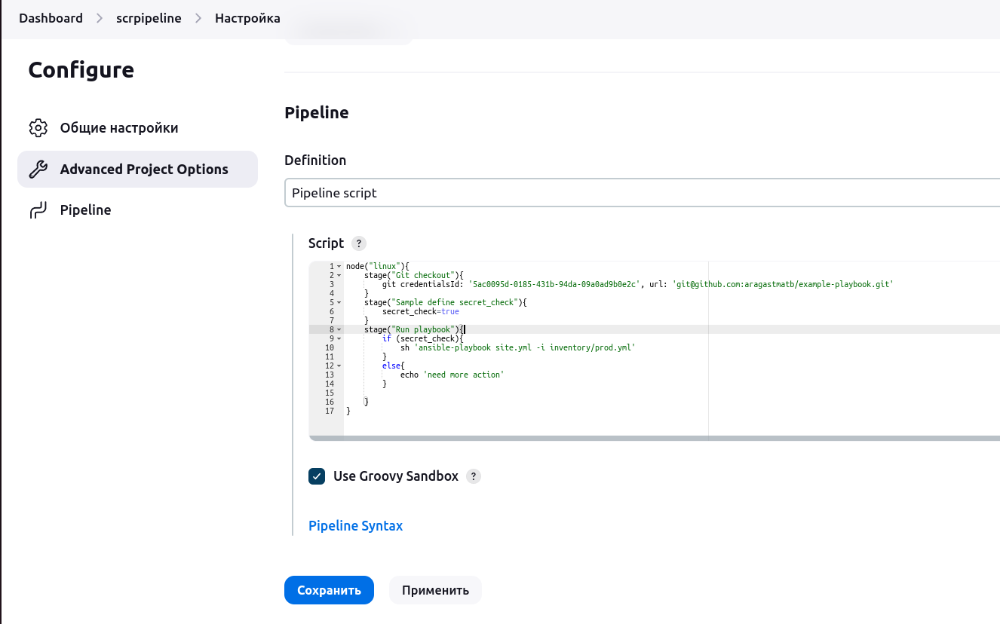

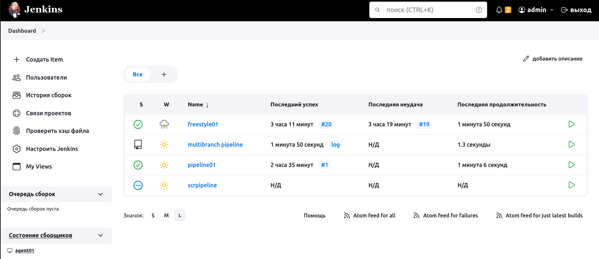

</details>


6. Внести необходимые изменения, чтобы Pipeline запускал `ansible-playbook` без флагов `--check --diff`, если не установлен параметр при запуске джобы (prod_run = True). По умолчанию параметр имеет значение False и запускает прогон с флагами `--check --diff`.

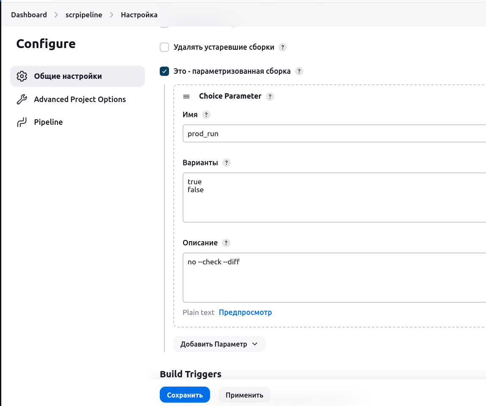

<details>
<summary>true</summary>
Started by user admin
[Pipeline] Start of Pipeline
[Pipeline] node
Running on agent01 in /opt/jenkins_agent/workspace/scrpipeline
[Pipeline] {
[Pipeline] stage
[Pipeline] { (Git checkout)
[Pipeline] git
The recommended git tool is: NONE
using credential 85797c52-4585-44dc-bb77-3e6835331d79
Fetching changes from the remote Git repository
Checking out Revision 20bd8d945340bb742acdd9e8c1a8fb5b73cc1700 (refs/remotes/origin/master)
Commit message: "Merge branch 'master' of https://github.com/aragastmatb/example-playbook"
 > git rev-parse --resolve-git-dir /opt/jenkins_agent/workspace/scrpipeline/.git # timeout=10
 > git config remote.origin.url https://github.com/aragastmatb/example-playbook.git # timeout=10
Fetching upstream changes from https://github.com/aragastmatb/example-playbook.git
 > git --version # timeout=10
 > git --version # 'git version 1.8.3.1'
using GIT_SSH to set credentials git
[INFO] Currently running in a labeled security context
[INFO] Currently SELinux is 'enforcing' on the host
 > /usr/bin/chcon --type=ssh_home_t /opt/jenkins_agent/workspace/scrpipeline@tmp/jenkins-gitclient-ssh9345838713044104123.key
Verifying host key using known hosts file
You're using 'Known hosts file' strategy to verify ssh host keys, but your known_hosts file does not exist, please go to 'Manage Jenkins' -> 'Security' -> 'Git Host Key Verification Configuration' and configure host key verification.
 > git fetch --tags --progress https://github.com/aragastmatb/example-playbook.git +refs/heads/*:refs/remotes/origin/* # timeout=10
 > git rev-parse refs/remotes/origin/master^{commit} # timeout=10
 > git config core.sparsecheckout # timeout=10
 > git checkout -f 20bd8d945340bb742acdd9e8c1a8fb5b73cc1700 # timeout=10
 > git branch -a -v --no-abbrev # timeout=10
 > git branch -D master # timeout=10
 > git checkout -b master 20bd8d945340bb742acdd9e8c1a8fb5b73cc1700 # timeout=10
 > git rev-list --no-walk 20bd8d945340bb742acdd9e8c1a8fb5b73cc1700 # timeout=10
[Pipeline] }
[Pipeline] // stage
[Pipeline] stage
[Pipeline] { (Run playbook)
[Pipeline] sh
+ ansible-playbook site.yml -i inventory/prod.yml

PLAY [Install Java] ************************************************************

TASK [Gathering Facts] *********************************************************
ok: [localhost]

TASK [java : Upload .tar.gz file containing binaries from local storage] *******
skipping: [localhost]

TASK [java : Upload .tar.gz file conaining binaries from remote storage] *******
ok: [localhost]

TASK [java : Ensure installation dir exists] *********************************** ok: [localhost]

TASK [java : Extract java in the installation directory] *********************** skipping: [localhost]

TASK [java : Export environment variables] ************************************* ok: [localhost]

PLAY RECAP ********************************************************************* localhost : ok=4 changed=0 unreachable=0 failed=0 skipped=2 rescued=0 ignored=0

[Pipeline] }
[Pipeline] // stage
[Pipeline] }
[Pipeline] // node
[Pipeline] End of Pipeline
Finished: SUCCESS

</details>

<details>
<summary>false</summary>

Started by user admin
[Pipeline] Start of Pipeline
[Pipeline] node
Running on agent01 in /opt/jenkins_agent/workspace/scrpipeline
[Pipeline] {
[Pipeline] stage
[Pipeline] { (Git checkout)
[Pipeline] git
The recommended git tool is: NONE
using credential 85797c52-4585-44dc-bb77-3e6835331d79
Fetching changes from the remote Git repository
Checking out Revision 20bd8d945340bb742acdd9e8c1a8fb5b73cc1700 (refs/remotes/origin/master)
Commit message: "Merge branch 'master' of https://github.com/aragastmatb/example-playbook"
 > git rev-parse --resolve-git-dir /opt/jenkins_agent/workspace/scrpipeline/.git # timeout=10
 > git config remote.origin.url https://github.com/aragastmatb/example-playbook.git # timeout=10
Fetching upstream changes from https://github.com/aragastmatb/example-playbook.git
 > git --version # timeout=10
 > git --version # 'git version 1.8.3.1'
using GIT_SSH to set credentials git
[INFO] Currently running in a labeled security context
[INFO] Currently SELinux is 'enforcing' on the host
 > /usr/bin/chcon --type=ssh_home_t /opt/jenkins_agent/workspace/scrpipeline@tmp/jenkins-gitclient-ssh1947176522170178572.key
Verifying host key using known hosts file
You're using 'Known hosts file' strategy to verify ssh host keys, but your known_hosts file does not exist, please go to 'Manage Jenkins' -> 'Security' -> 'Git Host Key Verification Configuration' and configure host key verification.
 > git fetch --tags --progress https://github.com/aragastmatb/example-playbook.git +refs/heads/*:refs/remotes/origin/* # timeout=10
 > git rev-parse refs/remotes/origin/master^{commit} # timeout=10
 > git config core.sparsecheckout # timeout=10
 > git checkout -f 20bd8d945340bb742acdd9e8c1a8fb5b73cc1700 # timeout=10
 > git branch -a -v --no-abbrev # timeout=10
 > git branch -D master # timeout=10
 > git checkout -b master 20bd8d945340bb742acdd9e8c1a8fb5b73cc1700 # timeout=10
 > git rev-list --no-walk 20bd8d945340bb742acdd9e8c1a8fb5b73cc1700 # timeout=10
[Pipeline] }
[Pipeline] // stage
[Pipeline] stage
[Pipeline] { (Run playbook)
[Pipeline] sh
+ ansible-playbook site.yml -i inventory/prod.yml --check --diff

PLAY [Install Java] ************************************************************

TASK [Gathering Facts] *********************************************************
ok: [localhost]

TASK [java : Upload .tar.gz file containing binaries from local storage] *******
skipping: [localhost]

TASK [java : Upload .tar.gz file conaining binaries from remote storage] *******
ok: [localhost]

TASK [java : Ensure installation dir exists] *********************************** ok: [localhost]

TASK [java : Extract java in the installation directory] *********************** skipping: [localhost]

TASK [java : Export environment variables] ************************************* ok: [localhost]

PLAY RECAP ********************************************************************* localhost : ok=4 changed=0 unreachable=0 failed=0 skipped=2 rescued=0 ignored=0

[Pipeline] }
[Pipeline] // stage
[Pipeline] }
[Pipeline] // node
[Pipeline] End of Pipeline
Finished: SUCCESS
</details>

7. Проверить работоспособность, исправить ошибки, исправленный Pipeline вложить в репозиторий в файл `ScriptedJenkinsfile`.
[ScriptedJenkinsfile](pipeline/ScriptedJenkinsfile)

>Ensure installation dir exists] ***********************************
>fatal: [localhost]: FAILED! => {"changed": false, "module_stderr": "sudo: a password is required\n", "module_stdout": "", "msg": >"MODULE FAILURE\nSee stdout/stderr for the exact error", "rc": 1}

Из вообщения видно, что ansible пытается выполнить команду с повышенными привелегиями (sudo), но соответствующий пароль не задан. Проблему можно решить разными способами - подробнее в статье Ansible – “sudo: a password is required”

Я выбрал вариант попроще, а именно - не спрашивать пароль для sudo операций пользователя jenkins для чего нужно:

    Подключиться к ноде агента: ssh centos@178.154.254.18
    Выполнить команду sudo visudo
    Добавить в конец файла строку jenkins  ALL=(ALL) NOPASSWD:ALL


8. Отправить ссылку на репозиторий с ролью и Declarative Pipeline и Scripted Pipeline.

[Vector-role2](https://github.com/YTimashev/vector-role2), [Declarative Pipeline](https://github.com/YTimashev/vector-role2/blob/main/pipeline/jenkinsfile), [Scripted Pipeline](pipeline/ScriptedJenkinsfile)


### Как оформить решение задания

Выполненное домашнее задание пришлите в виде ссылки на .md-файл в вашем репозитории.

---
