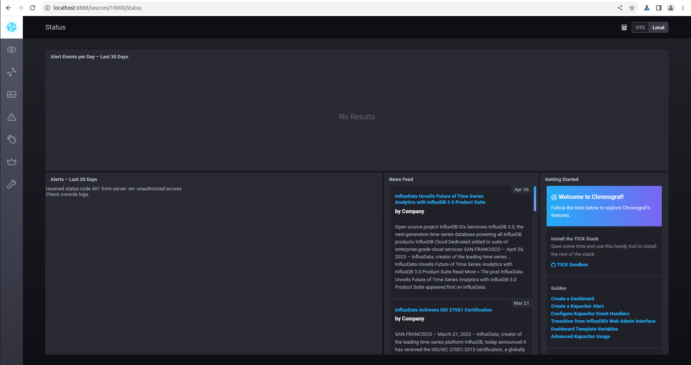
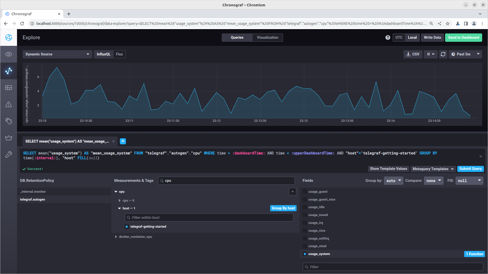
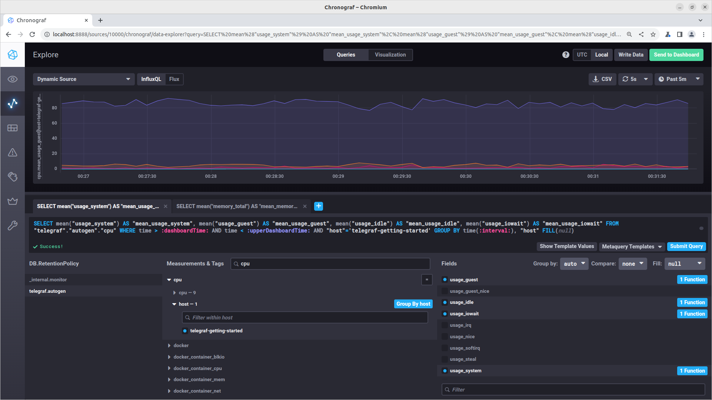

# Домашнее задание к занятию "13.Системы мониторинга"

## Обязательные задания

1. Вас пригласили настроить мониторинг на проект. На онбординге вам рассказали, что проект представляет из себя платформу для вычислений с выдачей текстовых отчётов, которые сохраняются на диск. 
Взаимодействие с платформой осуществляется по протоколу http. Также вам отметили, что вычисления загружают ЦПУ. Какой минимальный набор метрик вы выведите в мониторинг и почему?
>В самом вопросе уже присутствует ответ: Первое что необходимо настроить - это отслеживание нагрузки на CPU, далее мониторинг дисковой системы: производительность, доступное место на диске. а так как взаимодесйствие с платформой осуществляется посредством http - необходимо настроить метрики сетвых интерфейсов, величину трафика, количество соединений, отказов, ошибок, доступности платформы через анализ кодов ответа.

2. Менеджер продукта, посмотрев на ваши метрики, сказал, что ему непонятно, что такое RAM/inodes/CPUla. Также он сказал, что хочет понимать, насколько мы выполняем свои обязанности перед клиентами и какое качество обслуживания. Что вы можете ему предложить?
>Опять же для оценки качества обслуживания, необходимо настроить мониторинг доступа сервиса посредстовм ответа по кодам и длительности обработки запросов. Для понимания менеджером качества обслуживания, можно настроить метрики на процентные показания упешных кодов и кодов отказа/ошибок, длительности обработки запросов. Для каждой метрики можно определить значения при которых фактические показания и будут указывать на оценку качества выполнения обязательств перед клиентами.

3. Вашей DevOps-команде в этом году не выделили финансирование на построение системы сбора логов. Разработчики, в свою очередь, хотят видеть все ошибки, которые выдают их приложения. Какое решение вы можете предпринять в этой ситуации, чтобы разработчики получали ошибки приложения?
>Думаю в данном случае можно воспользоваться готовыми решениями такими как ELK, которые не требуют значительных временных и финансовых затрат, либо воспользоваться облачными системами, такими как Sentry, Yandex Cloud Logging и пр., которые допускают бесплатное использование.

3. Вы, как опытный SRE, сделали мониторинг, куда вывели отображения выполнения SLA = 99% по http-кодам ответов. 
Этот параметр вычисляется по формуле: summ_2xx_requests/summ_all_requests. Он не поднимается выше 70%, но при этом в вашей системе нет кодов ответа 5xx и 4xx. Где у вас ошибка?
>Предпологаю что формула 'summ_2xx_requests/summ_all_requests' не совсем корректна, при остутсвие в системе кодов ответа 5xx и 4xx SLA не может быть 70%. Полагаю что правильно считать по следующей формуле 'SLA = (summ_2xx_requests + summ_3xx_requests + summ_1xx_requests) / summ_all_requests' т.к. коды ответов 3xx это перенаправления, а коды 1xx имеют информационный характер.

5. Опишите основные плюсы и минусы pull и push систем мониторинга.

>###Push
>Плюсы:
>- Push-системы мониторинга позволяют отправлять данные в реальном времени, что делает их более подходящими для мониторинга важных событий и быстрого реагирования.
>- Простота настройки центрального сервера: В push-системах, центральный сервер легче настраивается для обработки данных от большого количесвта  клиентских систем.
>- Уведомления в режиме реального времени: Push-системы могут легко отправлять уведомления о событиях в реальном времени данных мониторинга.

>Минусы:
>- Высокая нагрузка. При использовании push-систем бывают проблемы с нагрузкой на целевые системы, особенно если большое количество данных отправляется в реальном времени.
>- Сложность настройки агентов: Настройка и установка агентов на целевых серверах бывает сложной и требовательной к ресурсам.
>- Push-системы требуют от целевых систем предоставлять доступ для приема данных мониторинга, отсюда риски с безопасностью.

>###Pull
>Плюсы:
>- Низкая нагрузка на целевые системы: В pull-системах мониторинга, клиенты опрашивают целевые системы по запросу, это позволяет точно контролировать частоту опроса и снизить нагрузку.
>- Простая настройка и установка: Pull-системы проще настраивать и устанавливать, так как агенты мониторинга легко разворачиваются на целевых серверах без дополнительных настроек на стороне сервера.
>- Целевые системы могут не знать о мониторинге со стороны агентов, что может быть полезно в ситуациях для соблюдения конфиденциальности.

>Минусы:
>- Задержка в обновлении данных: Поскольку мониторинговые агенты опрашивают целевые системы по расписанию, существует задержка в обновлении данных. Это может снизить способность обнаружения проблем в режиме реального времени.
>- Потеря данных: Если агент неспособен опросить целевую систему (отстутсвие сети, сбой), это может привести к потере данных мониторинга.


6. Какие из ниже перечисленных систем относятся к push модели, а какие к pull? А может есть гибридные?

    - Prometheus - pull
    - TICK - push
    - Zabbix - push/pull
    - VictoriaMetrics - push/pull
    - Nagios - pull


7. Склонируйте себе [репозиторий](https://github.com/influxdata/sandbox/tree/master) и запустите TICK-стэк, 
используя технологии docker и docker-compose.
```console
tim@tim:~$ git clone https://github.com/influxdata/sandbox.git
tim@tim:~$ cd sandbox/
tim@tim:~/sandbox$ docker-compose up -d
```
>при выполнении комады вылезла ошибки:
```
WARN[0000] The "TYPE" variable is not set. Defaulting to a blank string. 
WARN[0000] The "TYPE" variable is not set. Defaulting to a blank string. 
WARN[0000] The "TYPE" variable is not set. Defaulting to a blank string. 
WARN[0000] The "TYPE" variable is not set. Defaulting to a blank string. 
```
>и
```
failed to solve: rpc error: code = Unknown desc = failed to solve with frontend dockerfile.v0: failed to create LLB definition: failed to parse stage name "chronograf:chronograf:latest": invalid reference format
```
>после запуска переменной вручную `export TYPE=latest` 
>и правки файла c перeменнными `.env`, команда отработала успешно.

В виде решения на это упражнение приведите скриншот веб-интерфейса ПО chronograf (`http://localhost:8888`). 



P.S.: если при запуске некоторые контейнеры будут падать с ошибкой - проставьте им режим `Z`, например
`./data:/var/lib:Z`
> установка режима Z не помогла, контейнер sandbox-kapacitor-1 упорно падал. по этой причине chronograf не отражал БД. В итоге весь TICK-стэк был успешно и без ошибок перезапущен командой `./sandbox up`

8. Перейдите в веб-интерфейс Chronograf (http://localhost:8888) и откройте вкладку Data explorer.
        
    - Нажмите на кнопку Add a query
    - Изучите вывод интерфейса и выберите БД telegraf.autogen
    - В `measurments` выберите cpu->host->telegraf-getting-started, а в `fields` выберите usage_system. Внизу появится график утилизации cpu.
    - Вверху вы можете увидеть запрос, аналогичный SQL-синтаксису. Поэкспериментируйте с запросом, попробуйте изменить группировку и интервал наблюдений.

Для выполнения задания приведите скриншот с отображением метрик утилизации cpu из веб-интерфейса.

  

9. Изучите список [telegraf inputs](https://github.com/influxdata/telegraf/tree/master/plugins/inputs). 
Добавьте в конфигурацию telegraf следующий плагин - [docker](https://github.com/influxdata/telegraf/tree/master/plugins/inputs/docker):
```
[[inputs.docker]]
  endpoint = "unix:///var/run/docker.sock"
```
>Добавлять данный плагин в конфигурацию telegraf не пришлось, он там уже был прописан.

Дополнительно вам может потребоваться донастройка контейнера telegraf в `docker-compose.yml` дополнительного volume и 
режима privileged:
```
  telegraf:
    image: telegraf:1.4.0
    privileged: true
    volumes:
      - ./etc/telegraf.conf:/etc/telegraf/telegraf.conf:Z
      - /var/run/docker.sock:/var/run/docker.sock:Z
    links:
      - influxdb
    ports:
      - "8092:8092/udp"
      - "8094:8094"
      - "8125:8125/udp"
```
>Донастроил контейнер следущим образом:
```yaml
  telegraf:
    # Full tag list: https://hub.docker.com/r/library/telegraf/tags/
    build:
      context: ./images/telegraf/
      dockerfile: ./${TYPE}/Dockerfile
      args:
        TELEGRAF_TAG: ${TELEGRAF_TAG}
    image: "telegraf"
    privileged: true
    user: telegraf:998
    environment:
      HOSTNAME: "telegraf-getting-started"
    # Telegraf requires network access to InfluxDB
    links:
      - influxdb
    volumes:
      # Mount for telegraf configuration
      - ./telegraf/:/etc/telegraf/
      # Mount for Docker API access
      - /var/run/docker.sock:/var/run/docker.sock
    depends_on:
      - influxdb
    ports:
      - "8092:8092/udp"
      - "8094:8094"
      - "8125:8125/udp"
```

После настройке перезапустите telegraf, обновите веб интерфейс и приведите скриншотом список `measurments` в 
веб-интерфейсе базы telegraf.autogen . Там должны появиться метрики, связанные с docker.

```console
tim@tim:~/sandbox$ ./sandbox restart
Using latest, stable releases
Stopping all sandbox processes...
Starting all sandbox processes...
Services available!
```


Факультативно можете изучить какие метрики собирает telegraf после выполнения данного задания.

### Как оформить решение задания

Выполненное домашнее задание пришлите в виде ссылки на .md-файл в вашем репозитории.


---